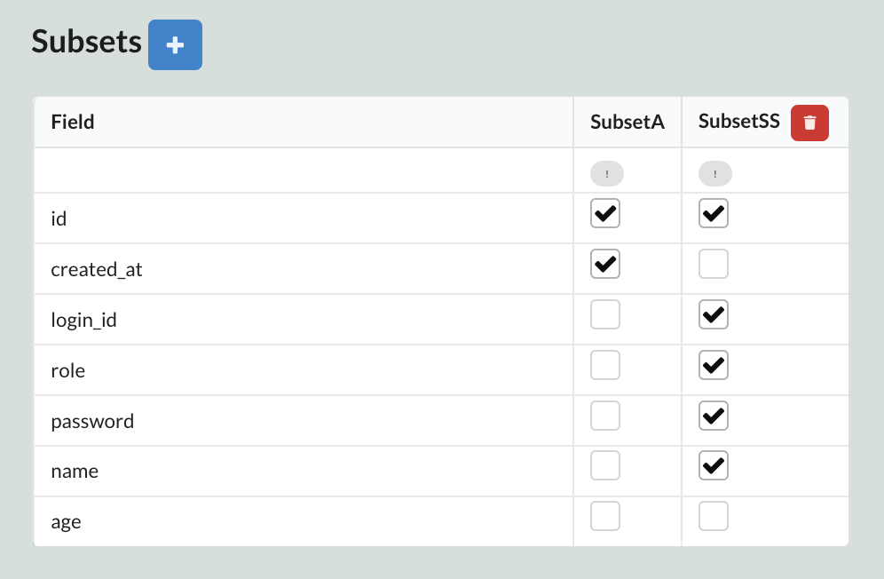
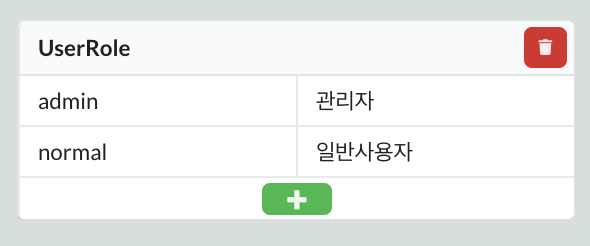
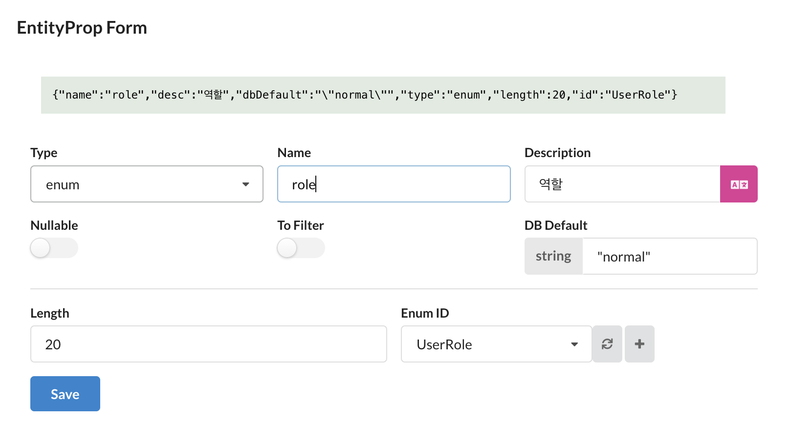

이 가이드에서는 Fastify에서 Passport를 사용하여 인증 및 인가를 구현하는 방법을 살펴보겠습니다.

<br/>

---

## 설치

`@fastify/passport`는 Fastify에서 Passport를 사용할 수 있도록 도와주는 플러그인입니다. Passport는 Node.js의 인증 미들웨어로, 다양한 인증 전략을 제공합니다. `@fastify/secure-session`는 Fastify에서 쿠키를 이용하여 세션을 안전하게 관리할 수 있도록 도와주는 플러그인입니다.

```shell
yarn add @fastify/passport @fastify/secure-session
```

<br/>

---

## 서브셋 설정

세션에서 사용할 사용자 정보를 정의합니다. Sonamu UI에 접속하여 유저 엔티티를 선택하고 `Subsets` 탭에서 서브셋 `SS`(Secure Subset)를 생성하고 필요한 필드를 선택합니다. 비밀번호 검증을 위해 `password` 필드를 추가합니다.



:::caution
서브셋 `SS`는 비밀번호를 포함하고 있으므로 보안에 주의해야 합니다.
`UserModel`의 `findMany`를 직접적으로 조작할 수 있는 api에 대해 접근 제한을 설정해야 합니다.
:::

<br/>

---

## Passport 설정

`@fastify/passport`와 `@fastify/secure-session` 플러그인을 Fastify에 등록합니다.

```typescript
// index.ts
import fastify from "fastify";
import fastifyPassport from "@fastify/passport";
import fastifySecureSession from "@fastify/secure-session";
import { UserSubsetSS } from "./application/sonamu.generated";

const server = fastify();

server.register(fastifySecureSession, {
  secret: "secret-key",
  salt: "salt",
  cookie: {
    domain: "localhost",
    path: "/",
    maxAge: 60000,
  },
});

server.register(fastifyPassport.initialize());
server.register(fastifyPassport.secureSession());

fastifyPassport.registerUserSerializer<UserSubsetSS, UserSubsetSS>(
  async (user, _request) => Promise.resolve(user)
);
fastifyPassport.registerUserDeserializer<UserSubsetSS, UserSubsetSS>(
  async (serialized, _request) => serialized
);
```

<br/>

---

## Context 확장

이제 API 핸들러 내에서 Sonamu의 `Context`를 이용하여 사용자 정보와 Passport의 인증 메서드를 사용할 수 있도록 `Context`를 확장합니다.

```typescript
// index.ts
import { Context, Sonamu } from "sonamu";

await Sonamu.withFastify(server, {
  contextProvider: (defaultContext, request) => {
    return {
      ...defaultContext,
      session: request.session,
      user: request.user ?? null,
      passport: {
        login: request.login.bind(request) as Context["passport"]["login"],
        logout: request.logout.bind(request) as Context["passport"]["logout"],
      },
    };
  },
  guardHandler: (_guard, _request, _api) => {
    console.log("NOTHING YET");
  },
});
```

이렇게 작성하면 `as Context["passport"]` 부분에서 `Property 'passport' does not exist on type 'Context'`에러가 발생합니다. 이는 타입스크립트가 `Context`에 `passport`프로퍼티가 없다고 판단하기 때문입니다. 이를 해결하기 위해`Context`타입에`passport` 프로퍼티를 추가합니다.

### 타입 확장

`src/typings/sonamu.d.ts` 파일을 생성하고 다음과 같이 `Context` 타입을 확장합니다. `user`의 타입은 `UserSubsetSS`로, `passport`의 타입은 `login`과 `logout` 메서드를 가지는 객체로 정의합니다.

```typescript
// sonamu.d.ts
import { Session } from "@fastify/secure-session";
import { UserSubsetSS } from "../application/sonamu.generated";

declare module "sonamu" {
  export interface ContextExtend {
    user: UserSubsetSS | null;
    passport: {
      login: (user: UserSubsetSS) => Promise<void>;
      logout: () => void;
    };
  }
}
```

Sonamu의 Context에서만 `user` 타입을 변경하면 `contextProvider`에서 타입 에러가 발생합니다. 이를 해결하기 위해 `src/typings/fastify.d.ts` 파일을 생성하고 다음과 같이 `PassportUser` 타입을 확장합니다.

```typescript
// fastify.d.ts
import { UserSubsetSS } from "../application/sonamu.generated";

declare module "fastify" {
  export interface PassportUser extends UserSubsetSS {}
}
```

이제 Passport를 이용하여 `SubsetSS`의 유저 정보를 저장하고 불러올 수 있습니다.

<br/>

---

## 인증

### 로그인 API 구현

먼저, 로그인을 위한 타입을 정의합니다.

```typescript
// user.types.ts
// User - LoginParams
export const UserLoginParams = z.object({
  login_id: z.string(),
  password: z.string(),
});
export type UserLoginParams = z.infer<typeof UserLoginParams>;
```

다음으로, Passport를 이용하여 로그인을 구현합니다.

```typescript
// user.model.ts
@api({ httpMethod: "POST" })
async login(
  params: UserLoginParams,
  context: Context
): Promise<UserSubsetSS> {
  const { login_id, password } = params;
  const user = await this.findOne("SS", { login_id });
  if (!user) {
    throw new NotFoundException("존재하지 않는 사용자입니다.");
  }
  if (password !== user.password) {
    throw new BadRequestException("비밀번호가 일치하지 않습니다.");
  }

  await context.passport.login(user);

  return user;
}
```

이제 로그인 API를 호출하면 `session`이라는 쿠키에 사용자 정보가 저장됩니다. 이후 API 호출 시 `context.user`에 사용자 정보가 저장되어 있습니다.

:::danger
비밀번호를 평문으로 저장하면 보안에 취약합니다. 실제 서비스에서는 비밀번호를 해시하여 저장하고, 로그인 시에도 해시된 비밀번호를 비교해야 합니다.
:::

### 로그아웃 API 구현

로그아웃 API를 구현합니다.

```typescript
// user.model.ts
@api({ httpMethod: "POST" })
logout(context: Context): void {
  context.passport.logout();
}
```

이제 로그아웃 API를 호출하면 `session` 쿠키가 초기화되어 사용자 정보가 삭제됩니다.

<br/>

---

## 인가

Sonamu에서는 요청 정보(FastifyRequest), API 정보, `@api` 데코레이터에 명시한 `guard`를 이용하여 인가를 처리할 수 있습니다. 간단하게 요청의 유저가 `@api` 데코레이터에 명시한 `guard`를 만족하는지 확인하는 예제를 살펴보겠습니다.

### 유저 엔티티

유저 엔티티에 `UserRole`이라는 열거형을 가지는 `role` 필드가 있다고 가정합니다.





### 가드핸들러 설정

Sonamu의 인가는 `guardHandler`에 의해 처리됩니다. `guardHandler`에서 매개변수의 `guard`, `request`, `api`를 이용하여 직접 오류를 발생시킬 수 있고, 오류를 발생시키지 않을 경우, 요청의 핸들러로 넘어갑니다.

`@api` 데코레이터의 guards에 명시된 권한이 `normal`인 경우에는 로그인한 사용자만 접근할 수 있도록 설정하고, `admin`인 경우에는 로그인한 사용자 중 `admin` 권한을 가진 사용자만 접근할 수 있도록 설정합니다.

```typescript
// index.ts
await Sonamu.withFastify(server, {
  contextProvider: (defaultContext, request) => {
    ...
  },
  guardHandler: (guard, request, _api) => {
    if (guard === "admin") {
      if (request.user?.role !== "admin") {
        throw new UnauthorizedException("관리자만 접근할 수 있습니다.");
      }
    } else if (guard === "normal") {
      if (!request.user) {
        throw new UnauthorizedException("로그인이 필요합니다.");
      }
    }
  },
});
```

### API 설정

사용자의 권한을 확인하기 위해 API에 가드를 설정합니다. 사용자 정보 수정 API를 `admin` 권한을 가진 사용자만 접근할 수 있도록 설정합니다.

```typescript
// user.model.ts
@api({ httpMethod: "POST", guards: ["admin"] })
async save(spa: UserSaveParams[]): Promise<number[]> {
  ...
}
```
