Sonamu에서 엔티티는 데이터베이스의 테이블과 1:1로 매핑되는 개념입니다. 엔티티는 데이터베이스의 스키마를 정의하고, 해당 엔티티를 기반으로 모델 코드를 생성합니다.

## 엔티티 정의

Sonamu UI에 접속하여 엔티티를 생성하거나 수정할 수 있습니다.

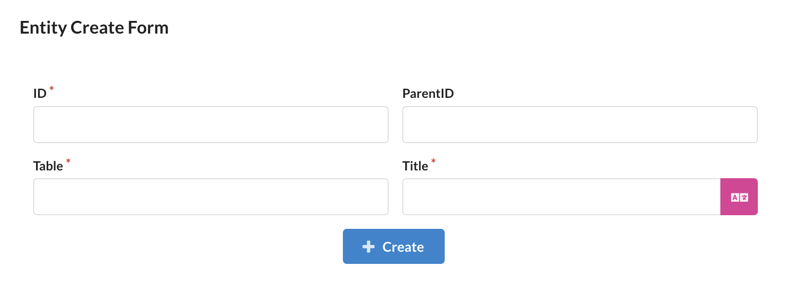

엔티티를 정의하려면 `ID`, `Table`, `Title`, `ParentID`(optional)를 입력해야 합니다. `ID`는 엔티티의 고유 식별자이며, `Table`은 해당 엔티티와 매핑되는 데이터베이스 테이블명입니다. `Title`은 엔티티의 이름을 나타내며, `ParentID`는 부모 엔티티의 ID를 입력합니다. Entity ID는 CamelCase에 단수형으로 작성하며, Table은 snake_case에 복수형으로 작성하는 것을 권장합니다.

### 최상위 엔티티 생성

먼저, `ParentID`가 없는 경우에 대한 엔티티를 생성하는 방법을 알아보겠습니다.

게시글 엔티티를 생성하기 위해 `ID`, `Table`, `Title`을 입력합니다.

- ID: `Post`
- Table: `posts`
- Title: `게시글`

이렇게 입력하고 `Create` 버튼을 클릭하면 기본 필드로 `id`와 `create_at`을 가지고, `id`를 이용한 정렬과 검색을 위한 `PostOrderBy`, `PostSearchField`
열거형을 가진 엔티티가 생성됩니다. 백엔드 디렉터리의 `src/application` 폴더에 `post` 폴더가 생성되며, 해당 폴더에 `post.entity.json`, `post.types.ts` 파일이 생성됩니다.

### 하위 엔티티 생성

상위 엔티티를 가지는 엔티티의 경우, `ParentID`에 상위 엔티티의 ID를 입력하여 엔티티를 생성할 수 있습니다.

게시글에 포함된 이미지 엔티티를 생성하기 위해 `ID`, `Table`, `Title`, `ParentID`를 입력합니다.

- ID: `PostImage`
- Table: `post_images`
- Title: `게시글 이미지`
- ParentID: `Post`

이렇게 입력하고 `Create` 버튼을 클릭하면 `Post` 엔티티에 속하는 `PostImage` 엔티티가 생성됩니다. 하위 엔티티는 타입 파일과 폴더를 생성하지 않고, 상위 엔티티 폴더 내에 엔티티 정의 파일(`post-image.entity.json`)만 생성됩니다.

```shell
Changed Files:  [
  '/src/application/post/post-image.entity.json',
  '/src/application/sonamu.generated.ts'
]
// 액션: 스키마 생성
GENERATED  api/src/application/sonamu.generated.sso.ts
GENERATED  api/src/application/sonamu.generated.ts
// 액션: 파일 싱크 types / functions / generated
COPIED  web/src/services/sonamu.generated.ts
```

그리고 엔티티 정의를 보면, `ParentId`에 기재했던 `Post` 엔티티가 `BelongsToOne`으로 연결되어 있는 것을 확인할 수 있습니다.

```json
{
  ...
  "props": {
    ...,
    {
      "type": "relation",
      "name": "post",
      "relationType": "BelongsToOne",
      "with": "Post",
      "onUpdate": "CASCADE",
      "onDelete": "CASCADE",
      "desc": "게시글"
    },
  }
}
```

## 필드 정의

Sonamu UI에서 필드를 추가할 엔티티의 상세 페이지로 이동합니다.

### 기본 필드

MySQL 데이터베이스의 기본 데이터 타입에 해당하는 필드를 추가하는 작업을 설명합니다.

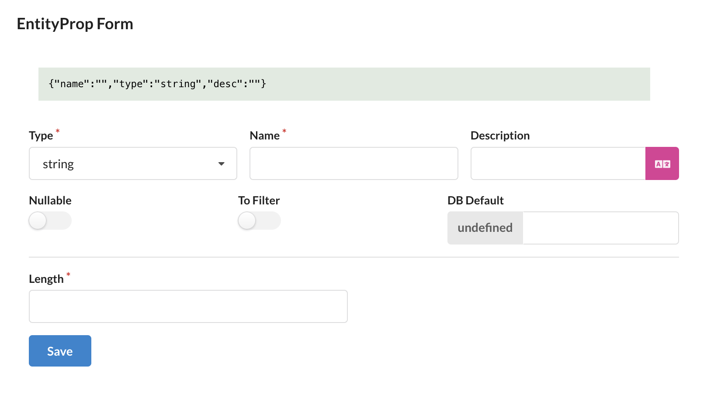

원하는 타입을 선택하고, `Name`, `Description`, `DB Default` 그리고 타입별 추가 정보를 입력합니다. 타입별 추가 정보는 모두 입력해야 합니다. `Name`은 컬럼명, `Description`은 필드에 대한 설명을 나타냅니다. `DB Default`는 필드의 기본값을 설정할 수 있습니다. `Name`은 테이블명과 동일하게 snake_case로 작성하는 것을 권장합니다.

#### 디폴트 값

`DB Default`는 아래와 같이 입력할 수 있습니다.

| 타입        | 예시                                                                                           |
| ----------- | ---------------------------------------------------------------------------------------------- |
| `undefined` | 기본값을 설정하지 않습니다.                                                                    |
| `string`    | 따옴표로 감싸면 문자열로 인식합니다.                                                           |
| `number`    | 따옴표 없이 숫자만 입력하면 숫자로 인식합니다.                                                 |
| `raw`       | 나머지 모든 입력은 raw로 인식하여 `knex.raw`를 사용하여 입력합니다.<br>e.g.) CURRENT_TIMESTAMP |

### relation 필드

엔티티 간의 관계를 나타내는 필드를 추가하는 작업을 설명합니다.

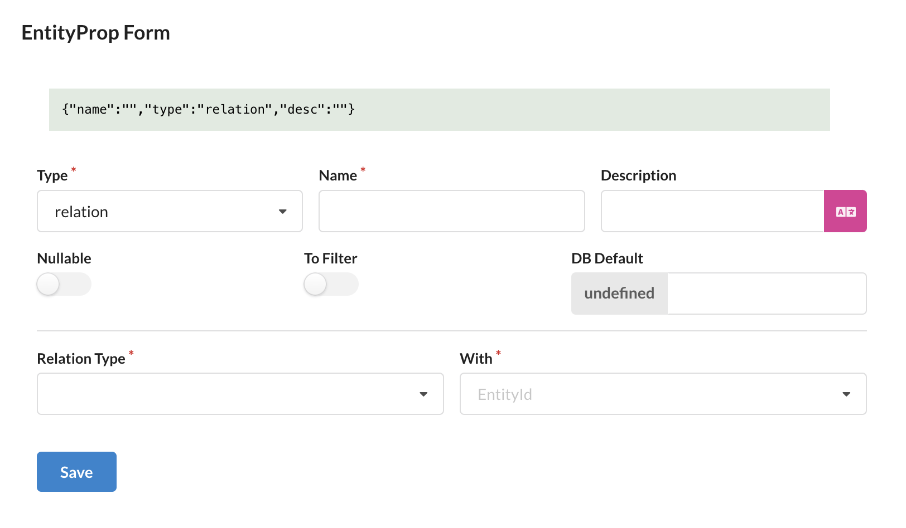

필드 타입을 `relation`으로 설정하면 `Name`, `Description` 외에 `Relation Type`, `With`가 추가됩니다. `Relation Type`은 `OneToOne`, `BelongsToOne`, `HasMany`, `ManyToMany` 중 하나를 선택할 수 있습니다. `With`는 관계를 맺는 엔티티의 ID를 입력합니다.

이제 각 관계 타입에 대해 설명하겠습니다.

#### OneToOne

`OneToOne` 관계는 두 엔티티 간의 1:1 관계를 나타냅니다. `Relation Type`을 `OneToOne`으로 설정하면 `HasJoinColumn`이 추가됩니다. `HasJoinColumn`은 현재 엔티티에 조인 컬럼, 즉 외래키를 추가할지 여부를 나타냅니다.

`HasJoinColumn`을 체크하면 현재 엔티티에 외래키 관련 설정인 `ON UPDATE`, `ON DELETE`를 설정해야 합니다. 조인 컬럼은 `${with}_id` 형식으로 생성됩니다. `HasJoinColumn`을 체크하지 않으면 관련 컬럼이 생성되지 않고, 서브셋을 이용하여 조회할 때 사용할 수 있습니다. 이런 경우 상대 엔티티에 조인 컬럼이 존재해야 합니다.

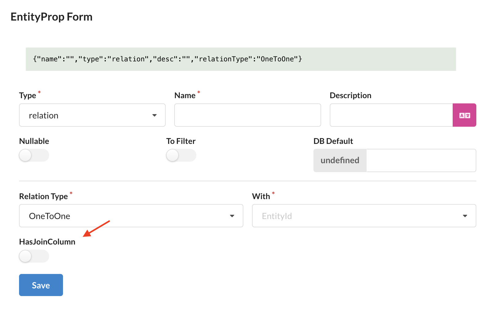
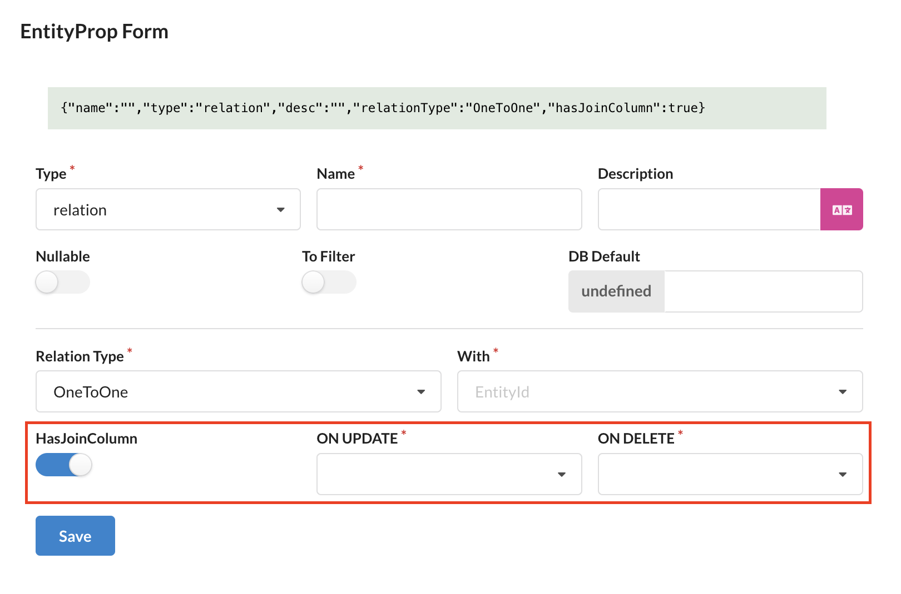

#### BelongsToOne

`BelongsToOne` 관계는 N:1 관계를 나타냅니다. `Relation Type`을 `BelongsToOne`으로 설정하면 `With` 필드에 상위 엔티티의 ID를 입력하고, `ON UPDATE`, `ON DELETE`를 설정해야 합니다.

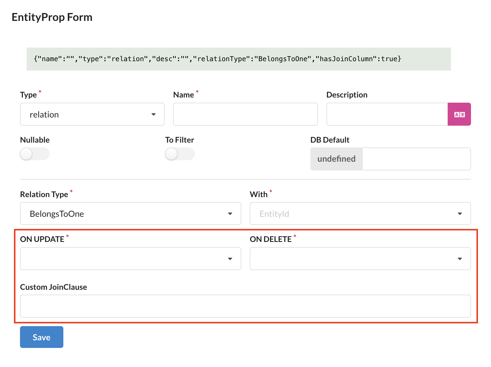

`BelongsToOne` 관계는 해당 엔티티에 조인 컬럼, 즉 외래키를 추가합니다. 필드를 추가할 때 입력한 `Name`을 이용하여 `${name}_id` 형식으로 조인 컬럼이 생성됩니다.

`Custom JoinClause`를 이용하면 현재 엔티티와 상위 엔티티를 조인할 때 사용할 조인 조건을 설정할 수 있습니다. 기본값은 상위 엔티티의 `id` 컬럼과 현재 엔티티의 조인 컬럼을 이용합니다.

#### HasMany

`HasMany` 관계는 1:N 관계를 나타냅니다. `Relation Type`을 `HasMany`로 설정하면 `With` 필드에 하위 엔티티의 ID를 입력하고, `JoinColumn`, `FromColumn`을 설정해야 합니다. `JoinColumn`은 하위 엔티티의 조인 컬럼, `FromColumn`은 `JoinColumn`과 연결되는 현재 엔티티의 컬럼을 기재합니다.

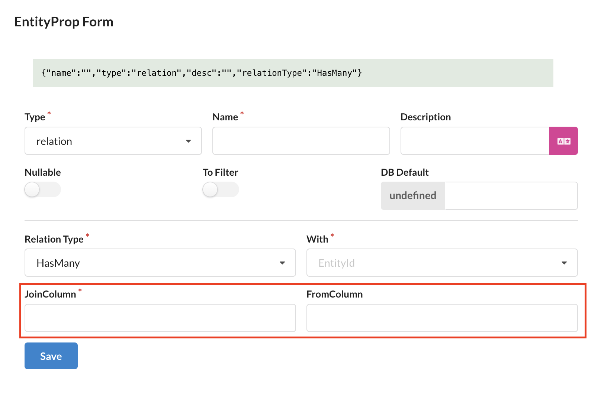

- `JoinColumn`은 위의 `BelongsToOne` 관계에서 생성된 조인 컬럼과 동일한 컬럼을 의미합니다.
- e.g.) User - Post 관계에서 User에 `HasMany`로 Post를 추가할 때, `JoinColumn`은 `author_id`, `FromColumn`은 `id`로 설정합니다.
- 해당 필드는 컬럼으로 생성되지 않습니다.

#### ManyToMany

`ManyToMany` 관계는 N:M 관계를 나타냅니다. `Relation Type`을 `ManyToMany`로 설정하면 `With` 필드에 관계 엔티티의 ID를 입력하고, `JoinTable`, `ON UPDATE`, `ON DELETE`를 설정해야 합니다. `JoinTable`은 두 엔티티의 조인을 위한 테이블로, 테이블명은 `${entity1}__${entity2}` 형식으로 작성합니다.

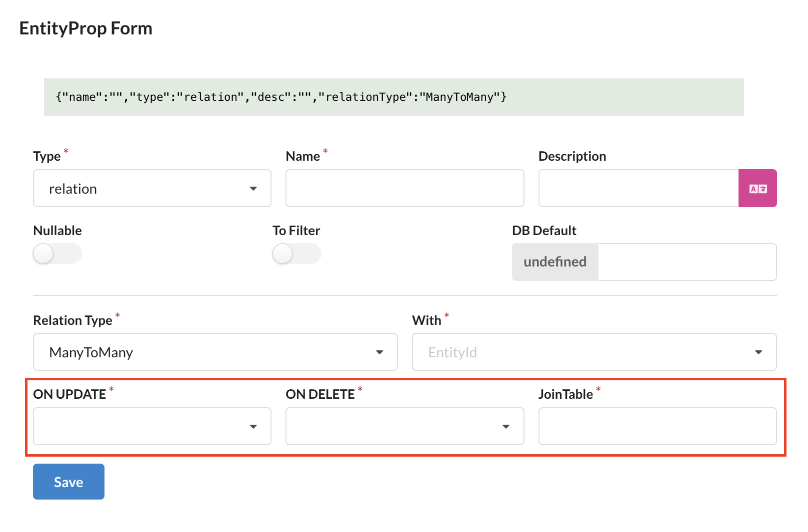

:::caution
`JoinTable`의 이름에는 언더바 하나가 아니라 두 개를 사용해야 합니다.
:::

### enum 필드

`enum` 타입을 가지는 필드를 추가하는 작업을 설명합니다. `enum` 타입은 정해진 값 중 하나를 선택하는 필드를 나타냅니다. 데이터베이스에서는 문자열로 저장되기 때문에 `Length`를 설정해야 합니다. `Enum ID`에는 백엔드에 생성되어 있는 모든 열거형을 선택할 수 있습니다. 필요한 값이 없는 경우 `+` 버튼을 눌러 추가하거나, 엔티티 페이지의 `Enums` 탭에서 추가할 수 있습니다.

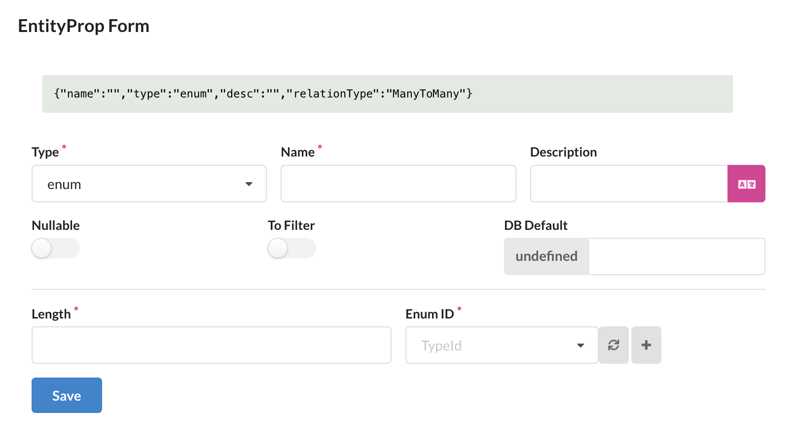

### virtual 필드

`virtual` 필드를 추가하는 작업을 설명합니다. `virtual` 필드는 데이터베이스에 컬럼으로 생성되지 않는 필드로, 서브셋에 포함되어 있을 경우, 서브셋 쿼리 결과에 포함시키는 작업이 필요합니다.


`virtual` 컬럼을 생성하려면 `CustomType ID`를 명시해야 합니다. `CustomType ID`는 전체 `.types.ts` 파일 기준으로 현재 생성되어 있는 타입 및 열거형(Zod 객체)의 이름으로 설정할 수 있습니다. 필요한 타입이 없을 경우에는 타입 파일 내에 필요한 타입 정의를 직접 추가하여 사용합니다. 위 이미지에서 `CustomType ID` 입력란 우측의 `</>` 버튼을 클릭하면 현재 엔티티의 타입 파일로 이동합니다.

```typescript
// virtual 필드에 사용할 타입 예시
export const Number = z.number();
export type Number = z.infer<typeof Number>;

export const Boolean = z.boolean();
export type Boolean = z.infer<typeof Boolean>;

export const Unknown = z.unknown();
export type Unknown = z.infer<typeof Unknown>;
```

서브셋 쿼리 결과에 포함시키기 위해서는 서브셋 쿼리를 빌드할 때, `virtual` 매개변수를 이용하여 쿼리를 추가해야 합니다. 그 전에, `virtual` 필드를 추가하고 나면 해당 엔티티의 `SaveParams` 등 타입에서 해당 필드를 제외하는 것을 잊지 마세요.

게시글 엔티티에 댓글 수를 나타내는 `comment_count`를 `virtual` 필드로 추가하고, 서브셋 쿼리 결과에 포함시키는 예시를 보겠습니다.

```typescript
// post.model.ts

@api({ httpMethod: "GET"})
async findMany<T extends PostSubsetKey>(
  subset: T,
  params: PostListParams = {},
  context?: Context
): Promise<ListResult<PostSubsetMapping[T]>> {
  ...

  // build queries
  let { rows, total } = await this.runSubsetQuery({
    subset,
    params,
    subsetQuery: postSubsetQueries[subset],
    build: ({ qb, db, virtual }) => {
      ...

      if (virtual.includes("comment_count")) {
        qb.select(
          db.raw("COUNT(comments.id) AS comment_count")
        ).leftJoin("comments", "comments.post_id", "posts.id").groupBy("posts.id");
      }

      ...
    }
  })

  ...
}
```

혹은 API를 호출할 때, 로그인한 사용자의 좋아요 여부를 나타내는 `is_liked`를 `virtual` 필드로 추가하고, 서브셋 쿼리 결과에 포함시키는 예시를 보겠습니다.

```typescript
// post.model.ts

@api({ httpMethod: "GET"})
async findMany<T extends PostSubsetKey>(
  subset: T,
  params: PostListParams = {},
  context?: Context
): Promise<ListResult<PostSubsetMapping[T]>> {
  ...

  // build queries
  let { rows, total } = await this.runSubsetQuery({
    subset,
    params,
    subsetQuery: postSubsetQueries[subset],
    build: ({ qb, db, virtual }) => {
      ...

      if (virtual.includes("is_liked") && context?.user) {
        qb.select(
          db.raw("IF(post_likes.id IS NULL, 0, 1) AS is_liked")
        ).leftJoin("post_likes", function () {
          this.on("post_likes.post_id", "posts.id").andOn(
            "post_likes.user_id",
            db.raw("?", [context.user!.id])
          );
        });
      }

      ...
    }
  })

  ...
}
```

### json 필드

`json` 필드는 `virtual` 필드와 동일하게, `CustomType ID`를 명시해야 합니다. `CustomType ID`는 전체 `.types.ts` 파일 기준으로 현재 생성되어 있는 타입 및 열거형(Zod 객체)의 이름으로 설정할 수 있습니다. 필요한 타입이 없을 경우에는 타입 파일 내에 필요한 타입 정의를 직접 추가하여 사용합니다.

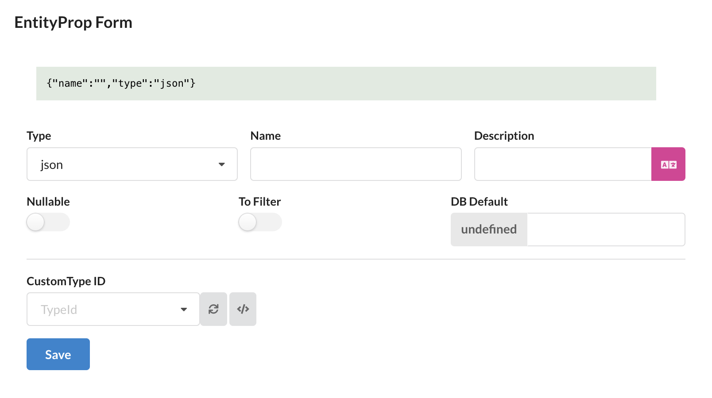

:::note
`enum` 필드와는 달리, 실제 데이터베이스의 JSON 타입의 컬럼으로 생성됩니다.
:::

## 인덱스 정의

Sonamu UI에서 인덱스를 추가할 엔티티의 상세 페이지로 이동합니다. `Indexes` 탭에서 `Add a Index` 버튼을 클릭하여 인덱스를 추가할 수 있습니다.

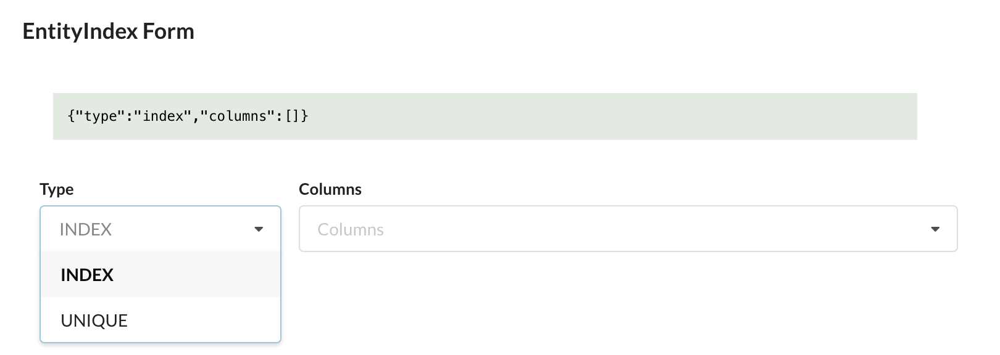

```

```
