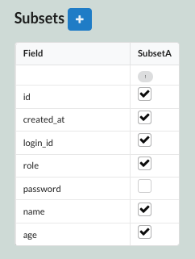
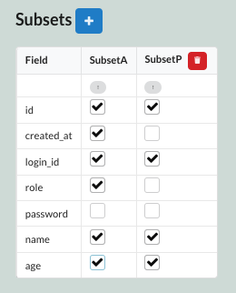

Sonamu에서는 컨벤션으로 어드민에서 사용할 서브셋은 `A`(A - Admin, All)로, 프론트에서 사용할 서브셋은 `P`(P - Public)로 지정합니다.

### 서브셋 추가

서브셋은 Sonamu UI의 `Entities` 화면에서 우측 하단에 있는 `Subsets` 테이블에서 설정합니다.



서브셋 `P`를 추가해봅시다.



서브셋 `A`는 백오피스에서, 서브셋 `P`는 프론트에서 사용됩니다.

### 서브셋 접근 제한

:::note
해당 주제는 [가이드 - 인증 및 인가](/guide/auth)를 통한 인가 설정이 완료되었다는 가정하에 작성되었습니다.
:::

현재 위에서 작성한 서브셋 `A`는 아무나 접근할 수 있습니다. 서브셋 `A`에 대한 접근을 제한하기 위해 `findMany`에 가드를 추가해봅시다.

서브셋과 관련한 접근 제한이 필요한 경우, `@api` 데코레이터에 `guards` 옵션을 설정합니다. 쿼리의 서브셋에 대한 접근 제한을 위해 `query`라는 가드를 추가합니다.

```ts
import { api } from "sonamu";


@api({ httpMethod: "GET", guards: ["query"] })
async findMany() {}
```

`query` 가드가 설정된 경우를 처리하기 위해, `Sonamu.withFastify`의 `guardHandler`에 해당 로직을 추가합니다.

```ts
// index.ts
import { Sonamu } from "sonamu";
import fastify from "fastify";

...

const server = fastify();

await Sonamu.withFastify(server, {
  guardHandler: (guard, request, _api) => {
    const user = request.user ?? null;
    if (guard === "query") {
      const query = request.query as {
        subset?: string;
      };
      if (
        query.subset &&
        query.subset.startsWith("A") &&
        (user === null || user.role !== "admin")
      ) {
        throw new UnauthorizedException("관리자만 접근할 수 있습니다.");
      }
    }

    // 다른 가드 처리
  },
  ...
});
```

이제 `A`로 시작하는 서브셋에 대한 접근은 관리자만 가능하도록 설정되었습니다.
