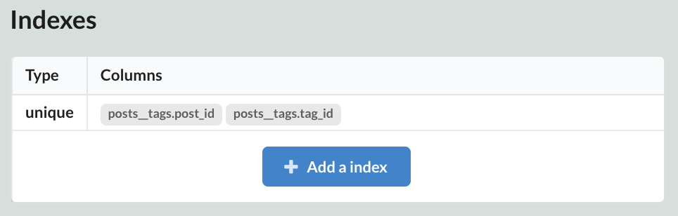

`UpsertBuilder`는 Sonamu 프레임워크에서 복잡한 데이터 구조를 효율적으로 저장하고 업데이트하기 위한 도구입니다. 이 문서에서는 `UpsertBuilder`의 사용법을 설명합니다.

### 기본 사용법

`register` 메서드와 `upsert` 메서드를 통해 데이터를 생성하거나 수정합니다. `register` 메서드는 실제 데이터베이스 쿼리를 실행하는 것이 아니라, 업데이트할 데이터를 받아서 UpsertBuilder 내부에 저장합니다. `upsert` 메서드를 호출하면, `register` 메서드로 저장된 데이터를 실제 데이터베이스에 저장합니다.

```typescript
import { api } from "sonamu";
import { BaseModelClass } from "sonamu/knex";
import { UserSaveParams } from "./user.types";

class UserModelClass extends BaseModelClass {
  @api({ httpMethod: "POST", guards: ["admin"] })
  async save(spa: UserSaveParams[]): Promise<number[]> {
    const wdb = this.getDB("w");
    const ub = this.getUpsertBuilder();

    spa.map((sp) => {
      ub.register("users", sp);
    });

    return wdb.transaction(async (trx) => {
      const ids = await ub.upsert(trx, "users");

      return ids;
    });
  }
}
```

`upsert` 메서드의 세 번째 인자로 `chunkSize`를 지정할 수 있습니다. `chunkSize`는 한 번에 처리할 데이터의 개수를 의미하며, 생략할 경우 한 번에 모든 데이터를 처리합니다.

단일 테이블의 데이터만 저장하는 경우에는 장점을 잘 느낄 수 없습니다. 복잡한 데이터를 한 번에 처리하는 예시를 보겠습니다.

### 중첩된 데이터 저장하기

`register` 메서드의 반환값인 `UBRef`를 이용하여 아직 입력되지 않은 데이터 간 관계를 설정할 수 있습니다. 이 기능을 이용하여 중첩된 데이터를 한 번에 저장할 수 있습니다.

1. 상위 테이블부터 하위 테이블 순서로 `register` 메서드를 호출합니다.
2. `register` 메서드의 반환값인 `UBRef`를 이용하여 상위 테이블의 ID를 입력해야 하는 위치에 주입합니다.
3. `register`한 순서대로 `upsert` 메서드를 호출합니다.
4. 저장 과정에서 `UBRef`는 실제 생성된 데이터의 ID로 치환됩니다.

아래는 Many-to-Many 관계인 게시글-태그 데이터를 저장하는 예시입니다. 게시글과 태그는 각각 `posts`와 `tags` 테이블에 저장하며, 게시글과 태그의 관계는 `posts__tags` 조인 테이블에 저장한다고 가정합니다. `posts__tags` 테이블은 게시글 ID와 태그 ID를 외래키로 가집니다.

```typescript
type PostSaveParams = {
  id?: number;
  title: string;
  content: string;
  tags?: string[];
};

@api({ httpMethod: "POST" })
async save(spa: PostSaveParams[]): Promise<number[]> {
  const wdb = this.getDB("w");
  const ub = this.getUpsertBuilder();

  spa.map(({ tags, ...sp }) => {
    const post_id = ub.register("posts", sp);

    tags?.map((name) => {
      const tag_id = ub.register("tags", { name });
      ub.register("posts__tags", {
        post_id,
        tag_id,
      });
    });
  });

  return wdb.transaction(async (trx) => {
    // register한 순서대로 upsert
    const ids = await ub.upsert(trx, "posts");
    await ub.upsert(trx, "tags");
    await ub.upsert(trx, "posts__tags");

    return ids;
  });
}
```

이렇게 코드를 작성하면 게시글과 태그를 분리하여 처리할 필요 없이 한 번에 처리할 수 있습니다. `register`는 상위 테이블 → 하위 테이블 순서로 호출해야 합니다. 그리고 `register`한 순서대로 `upsert` 메서드를 호출하여 데이터를 등록합니다.

`register`의 두 번째 인자에 unique 인덱스로 지정된 데이터가 없으면, `upsert` 메서드는 데이터를 생성하고, unique 인덱스가 있을 경우 해당 값을 가지는 데이터를 조회하여 존재하는 경우 해당 데이터를 갱신합니다. `upsert` 메서드는 실제 생성 혹은 갱신된 데이터의 ID를 반환합니다.

위 예시의 경우, `tag`의 `name`에 unique 제약이 걸려있다면 `tags` 테이블에 중복된 태그가 저장되지 않습니다.

게시글과 태그의 관계는 `posts__tags` 테이블에 저장되며, 기본적으로 `post_id`와 `tag_id`에 unique 제약이 걸려있지 않기 때문에 중복된 관계가 저장될 수 있습니다. 이 경우, `posts__tags` 테이블에 unique 제약을 걸어 중복된 관계가 저장되지 않도록 설정할 수 있습니다.

:::caution

Sonamu UI를 이용하여 관계 테이블(`posts__tags` 테이블)에 unique 제약을 설정하는 방법은 없기 때문에, **직접 엔티티 정의를 수정**해야 합니다. (위 예시에서는 `posts` 엔티티 정의 중 `indexes` 필드를 수정합니다.)

:::

```json
// posts.entity.json
{
  "indexes": [
    {
      "type": "unique",
      "columns": ["posts__tags.post_id", "posts__tags.tag_id"]
    }
  ]
}
```

Sonamu UI를 새로고침하면 `posts__tags` 테이블에 unique 제약이 걸려있는 것을 확인할 수 있습니다.



<br/>

### `upsert` 결과 이용하여 추가 작업 수행하기

`upsert` 메서드는 실제 생성 혹은 갱신된 데이터의 ID를 반환합니다. 이를 이용하여 추가 작업을 수행할 수 있습니다. 위의 게시글-태그 관계에서 `upsert`된 태그 외의 태그는 삭제하는 작업을 추가하겠습니다.

```typescript
@api({ httpMethod: "POST" })
async save(spa: PostSaveParams[]): Promise<number[]> {
  ...

  return wdb.transaction(async (trx) => {
    const ids = await ub.upsert(trx, "posts");
    await ub.upsert(trx, "tags");
    const savedTagIds = await ub.upsert(trx, "posts__tags");
    if (savedTagIds.length > 0) {
      await trx("posts__tags")
        .whereIn("post_id", ids)
        .whereNotIn("id", savedTagIds)
        .delete();
    }

    return ids;
  });
}
```

`upsert`된 태그의 ID를 `savedTagIds`에 저장하고, `post_id`가 `ids`에 속하면서 `id`가 `savedTagIds`에 속하지 않는 데이터를 삭제합니다.

### updateBatch로 데이터 갱신하기

`UpsertBuilder`의 `updateBatch`를 이용하면 케이스별로 다른 값을 가지는 데이터를 한 번에 갱신할 수 있습니다. Sonamu 내부적으로 `CASE WHEN`을 이용하는 SQL을 이용합니다.

아래 예시는 `id`가 1인 게시글의 `title`을 "New Title 1"로, `id`가 2인 게시글의 `title`을 "New Title 2"로 갱신하는 예시입니다. `updateBatch`는 기본적으로 `id` 컬럼을 기준으로 데이터를 갱신합니다.

```typescript
const params = [
  {
    id: 1,
    title: "New Title 1",
  },
  {
    id: 2,
    title: "New Title 2",
  },
];

const wdb = this.getDB("w");
const ub = this.getUpsertBuilder();

params.map((p) => {
  ub.register("posts", p);
});

await ub.updateBatch(wdb, "posts");
```

`updateBatch` 메서드의 세 번째 인자로 `where` 조건 및 `chunkSize`를 추가할 수 있습니다. `where` 조건에 해당하는 필드는 `register` 메서드의 두 번째 인자에 존재해야 합니다.

```typescript
const params = [
  {
    title: "New Title 1",
    content: "New Content 1",
  },
  {
    title: "New Title 2",
    content: "New Content 2",
  },
];

const wdb = this.getDB("w");
const ub = this.getUpsertBuilder();

params.map((p) => {
  ub.register("posts", p);
});

await ub.updateBatch(wdb, "posts", {
  where: "title",
  chunkSize: 1000,
});
```

`where` 조건은 배열로 여러 개의 조건을 지정할 수 있으며, 각 조건은 `AND`로 연결됩니다.

```typescript
await ub.updateBatch(wdb, "posts", {
  where: ["title", "content"],
});
```
