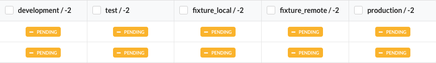
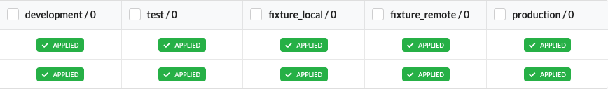

엔티티에 대한 추가, 수정 또는 삭제가 발생할 경우, Sonamu는 엔티티 정의와 데이터베이스 스키마를 비교하여 Knex.js 마이그레이션 형식의 코드를 준비합니다.

마이그레이션 파일은 `/api/src/migrations/` 경로 아래에 생성되며, 마이그레이션 작업에 따라 자동으로 네이밍 규칙이 적용됩니다. 필요한 경우 파일을 수정하여 사용할 수 있습니다.

:::danger
데이터베이스 적용이 끝난 마이그레이션 파일을 수정하거나 삭제하면 Sonamu의 마이그레이션이 제대로 동작하지 않을 수 있습니다.
:::

 

---

#### 마이그레이션 파일 생성

Sonamu에서 마이그레이션 작업은 `create`, `alter` 두 종류로 구분합니다. `create`는 **테이블**을 **추가**하는 작업을 의미하며, `alter`는 기존 테이블에 **컬럼**을 추가/변경/삭제하거나 **인덱스**를 추가/변경/삭제하는 작업을 의미합니다. 파일은 `create` → `alter column` → `alter index` 순서로 생성되며, 현재 타임스탬프에 인덱스를 더한 값을 파일명에 추가하여 마이그레이션 적용 순서를 관리합니다.

 

---

#### status

아래 화면에서 데이터베이스 이름 옆의 숫자는 현재 마이그레이션 적용 상태를 나타내는 것으로, Knex.js의 `Knex.migrate.status()`를 사용합니다. `knex_migrations` 테이블의 데이터와 `/migrations` 디렉터리의 파일을 비교하여 상태값을 나타냅니다. 모든 데이터베이스의 상태가 음수인 경우, 마이그레이션이 모두 적용된 최신 상태의 데이터베이스가 하나도 존재하지 않으면 마이그레이션 코드를 생성할 수 없습니다.

아래는 로컬에 생성된 마이그레이션 파일 2개가 대상 데이터베이스에 적용되지 않은 상태라는 것을 나타냅니다.

아래는 로컬의 모든 마이그레이션 파일이 대상 데이터베이스에 적용된 상태라는 것을 나타냅니다.

연결된 DB 중, 최신 상태의 DB가 없는 경우 새로운 마이그레이션 코드가 생성되지 않습니다.

 

---

#### shadow db test

Sonamu는 마이그레이션 실행 전에 **쉐도우 DB 테스트** 실행 여부를 결정할 수 있습니다.

쉐도우 DB 테스트란, 실제 데이터베이스에 마이그레이션 코드를 적용하기 전에 현재 데이터베이스와 동일한 구조의 임시 데이터베이스를 생성하여 마이그레이션을 적용하고 문제점을 찾아내는 테스트입니다.

쉐도우 DB 테스트를 실행하면 마이그레이션 코드를 적용하기 전에 미리 문제점을 찾아낼 수 있어, 실제 데이터베이스에 적용할 때 발생할 문제를 사전에 방지할 수 있습니다. 하지만 쉐도우 DB 테스트를 실행하면 마이그레이션 코드를 적용하는 시간이 더 오래 걸리므로, 필요에 따라 설정을 변경할 수 있습니다.

 

---

#### rollback

롤백은 파일 단위가 아닌, 트랜잭션 단위로 실행됩니다.
