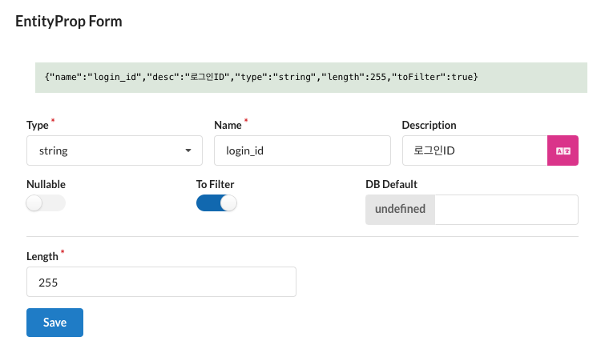

이전에 생성한 유저 엔티티와 모델 코드를 기반으로 회원가입 API를 작성해보겠습니다.

## 회원가입 API

아이디, 비밀번호, 이름, 나이를 입력받아 회원가입을 처리하는 API를 작성합니다. 회원가입 API는 `POST` 메서드로 작성하며, 회원가입에 필요한 파라미터를 `UserJoinParams` 타입으로 정의합니다.

### 타입 작성

먼저 회원가입에 필요한 zod 객체와 타입을 작성합니다. Sonamu는 메서드의 파라미터에 기재된 zod 객체를 사용하여 API 요청의 유효성을 검사하기 때문에, 타입은 zod 객체를 사용하여 작성합니다.

`UserBaseSchema`는 `ZodObject` 객체로, Sonamu가 자동으로 생성한 유저 엔티티의 zod 객체입니다. 해당 객체를 이용하여 기본적인 회원가입 파라미터를 정의해보겠습니다. `user.types.ts` 파일에 아래와 같은 코드를 추가합니다.

```typescript
// user.types.ts
// User - JoinParams
export const UserJoinParams = UserBaseSchema.pick({
  login_id: true,
  password: true,
  name: true,
  age: true,
});
export type UserJoinParams = z.infer<typeof UserJoinParams>;
```

:::note
타입 파일은 Sonamu의 동작에 의해 프론트엔드 디렉터리(정확히는 `sonamu.config.json`의 `sync.targets`)에 복사되기 때문에, 동일한 타입을 프론트엔드에서 바로 사용할 수 있습니다.
:::

위 코드를 추가하여 파일을 저장하면, 어플리케이션 서버 터미널에서 다음과 같은 로그가 출력됩니다. 타입 파일의 변경으로 인해 `sonamu.generated.ts`와 `sonamu.generated.sso.ts` 파일이 생성되고, 프론트엔드 디렉터리에 타입 파일이 복사되었습니다.

```shell
Changed Files:  [ '/src/application/user/user.types.ts' ]
// 액션: 스키마 생성
GENERATED  api/src/application/sonamu.generated.sso.ts
GENERATED  api/src/application/sonamu.generated.ts
// 액션: 파일 싱크 types / functions / generated
COPIED  web/src/services/user/user.types.ts
COPIED  web/src/services/sonamu.generated.ts
```

### 메서드 작성

이제 회원가입 API를 작성해봅시다. `user.model.ts` 파일을 열고, `join` 메서드를 작성하고, `@api` 데코레이터를 추가합니다. 아이디 중복 확인, 비밀번호 암호화 등의 로직은 생략하고, 간단하게 회원가입만 처리하도록 작성합니다. 저장 로직은 `save` 메서드를 이용하여 처리합니다.

```typescript
// user.model.ts
import { api } from "sonamu";
import { UserJoinParams } from "./user.types";

@api({ httpMethod: "POST" })
async join(params: UserJoinParams): Promise<number> {
  const sp: UserSaveParams = {
    ...params,
		role: "normal"
  };

  const [id] = await this.save([sp]);

  return id;
}
```

모델 파일에 회원가입 메서드를 추가하고 저장하면, 어플리케이션 서버 터미널에서 다음과 같은 로그가 출력됩니다.

```shell
Changed Files:  [ '/dist/application/user/user.model.js' ]
// 액션: 서비스 생성
GENERATED  web/src/services/user/user.service.ts
// 액션: HTTP파일 생성
GENERATED  api/src/application/sonamu.generated.http
```

위 로그는 프론트엔드에 API를 호출하는 서비스 코드와 백엔드에 API를 호출할 수 있는 HTTP 템플릿이 추가되었음을 의미합니다. 각 파일에 추가된 코드는 다음과 같습니다.

```typescript
// user.service.ts
export async function join(params: UserJoinParams): Promise<number> {
  return fetch({
    method: "POST",
    url: `/api/user/join`,
    data: { params },
  });
}
```

```http
// sonamu.generated.http
POST {{baseUrl}}/api/user/join
Content-Type: application/json

{
  "params": {
    "login_id": "LOGIN_ID",
    "password": "PASSWORD",
    "name": "NAME",
    "age": 0
  }
}
```

### API 호출

:::note
HTTP 파일에서 API를 호출하려면 VSCode의 [`REST Client`](https://marketplace.visualstudio.com/items?itemName=humao.rest-client) 확장 프로그램을 설치해야 합니다.
:::

`sonamu.generated.http` 파일에 작성된 API 호출 코드를 사용하여 회원가입 API를 호출해보겠습니다. Sonamu가 미리 작성한 파라미터를 수정하여, 회원가입에 필요한 데이터를 입력합니다.

```http
// sonamu.generated.http
POST {{baseUrl}}/api/user/join
Content-Type: application/json

{
  "params": {
    "login_id": "test",
    "password": "test",
    "name": "가나다",
    "age": 30
  }
}
```

`Send Request` 버튼을 클릭하면 회원가입 API가 호출되고, 생성된 회원의 아이디가 반환됩니다.

아래는 `curl` 명령어를 이용하여 API를 호출하는 방법입니다.

```shell
curl -X POST 'http://localhost:19000/api/user/join' \
-H 'Content-Type: application/json' \
-d '{
  "params": {
    "login_id": "test",
    "password": "test",
    "name": "가나다",
    "age": 30
  }
}'
```

<br/>

---

## 회원 조회 API

위에서 가입한 유저를 조회하기 위해 회원 조회 API를 작성해보겠습니다. 회원 조회 API는 아이디를 입력받아 해당 아이디의 회원 정보(아이디, 이름, 나이)를 조회하는 API입니다.

### `UserListParams` 타입 추가

Sonamu의 리스트 조회 API는 `ListParams` 타입을 이용하여 조회 조건을 설정합니다. `ListParams` 타입은 `UserBaseListParams`를 확장합니다. `UserBaseListParams`는 아래와 같은 기본 필드를 포함합니다.

- `num`: 페이지당 조회 개수
- `page`: 조회할 페이지
- `search`: 검색 필드
- `keyword`: 검색 키워드
- `orderBy`: 정렬 순서
  - 해당 엔티티의 `OrderBy` 열거형을 사용하여 정렬 순서를 설정합니다.
  - `field-direction` 형태로 기재하여 사용합니다.
- `queryMode`: 조회 모드
  - `list` 혹은 `count`로 설정하여 조회 결과를 `rows`만 반환하거나, `total`만 반환할 수 있습니다.
  - 지정하지 않으면 `rows`와 `total`을 모두 반환합니다.
- `id`: 조회할 아이디
  - `id`를 이용하여 조회할 경우, `queryMode`가 설정되지 않았다면 `list` 모드로 설정됩니다.
  - 배열로 입력받을 수 있습니다.

이제 로그인 아이디로 회원을 조회하기 위해 `UserListParams` 타입을 추가합니다. 기본적으로 `user.types.ts` 파일에 `UserListParams` 타입을 직접 수정하여 사용하지만, 엔티티에 정의된 필드를 이용하는 경우 필터 설정을 이용할 수 있습니다.

#### 필터 설정

엔티티에 정의된 필드를 조회 조건으로 사용하는 경우, 해당 필드의 `To Filter`를 체크하여 `UserBaseListParams`에 필드를 추가할 수 있습니다.



해당 필드를 배열로 입력받거나, 엔티티에 정의된 필드 외의 값을 이용하려면 `UserListParams`에 직접 필드를 추가하여 사용할 수 있습니다.

#### 직접 타입 작성

엔티티 필드 외에 추가적인 값을 조회 조건으로 사용하려면, 타입 파일에 직접 필드를 추가하여 사용할 수 있습니다. 타입 파일의 `UserListParams`에 `login_id` 필드를 추가합니다.

```typescript
// user.types.ts
import { z } from "zod";
import { UserBaseListParams } from "../sonamu.generated";
import { zArrayable } from "sonamu";

// User - ListParams
export const UserListParams = UserBaseListParams.extend({
  login_id: zArrayable(z.string()).optional(),
});
export type UserListParams = z.infer<typeof UserListParams>;
```

`login_id`는 문자열 혹은 문자열 배열을 입력받을 수 있도록 Sonamu의 `zArrayable`로 정의합니다.

### 메서드 작성

회원 조회 API는 스캐폴딩 과정에서 생성된 `UserListParams`와 `findMany`를 사용하여 작성합니다.
`ListParams` 설정이 완료되면, 추가된 필드를 이용한 조회 로직을 `findMany` 메서드에 직접 추가해야 합니다. `user.model.ts` 파일을 열고, 아래와 같이 `findMany` 메서드를 수정합니다.

```typescript
// user.model.ts
import { ListResult, asArray, BadRequestException, api } from "sonamu";
import { UserSubsetKey, UserSubsetMapping } from "../sonamu.generated";
import { userSubsetQueries } from "../sonamu.generated.sso";
import { UserListParams } from "./user.types";

@api({ httpMethod: "GET", clients: ["axios", "swr"], resourceName: "Users" })
async findMany<T extends UserSubsetKey>(
  subset: T,
  params: UserListParams = {}
): Promise<ListResult<UserSubsetMapping[T]>> {
  // params with defaults
  params = {
    num: 24,
    page: 1,
    search: "id",
    orderBy: "id-desc",
    ...params,
  };

  // build queries
  let { rows, total } = await this.runSubsetQuery({
    subset,
    params,
    subsetQuery: userSubsetQueries[subset],
    build: ({ qb }) => {
      // id
      if (params.id) {
        qb.whereIn("users.id", asArray(params.id));
      }

      // login_id <- 이 부분을 추가합니다.
      if (params.login_id) {
        qb.whereIn("users.login_id", asArray(params.login_id));
      }

      // search-keyword
      if (params.search && params.keyword && params.keyword.length > 0) {
        if (params.search === "id") {
          qb.where("users.id", params.keyword);
          // } else if (params.search === "field") {
          //   qb.where("users.field", "like", `%${params.keyword}%`);
        } else {
          throw new BadRequestException(
            `구현되지 않은 검색 필드 ${params.search}`
          );
        }
      }

      // orderBy
      if (params.orderBy) {
        // default orderBy
        const [orderByField, orderByDirec] = params.orderBy.split("-");
        qb.orderBy("users." + orderByField, orderByDirec);
      }

      return qb;
    },
    debug: false,
  });

  return {
    rows,
    total,
  };
}
```

`runSubsetQuery`는 `subset`과 `params`를 이용하여 데이터베이스 조회 쿼리를 작성하고, 조회 결과를 반환합니다. `build` 함수는 `qb` 객체를 사용하여 실제 데이터베이스 조회에 이용되는 쿼리를 작성하는 함수입니다. `login_id` 필드를 추가하여, `login_id`로 회원을 조회할 수 있도록 합니다. 자세한 내용은 [모델 - runSubsetQuery](/reference/model#runsubsetquery)를 참고하세요.

변경 내용을 저장하면 어플리케이션 서버 터미널에서 다음과 같은 로그가 출력됩니다.

```shell
Changed Files:  [ '/dist/application/user/user.model.js' ]
// 액션: 서비스 생성
GENERATED  web/src/services/user/user.service.ts
// 액션: HTTP파일 생성
GENERATED  api/src/application/sonamu.generated.http
```

#### Kysely 예시

`Kysely`를 사용하는 경우 쿼리빌더를 이용하는 부분이 달라집니다. `build` 함수를 아래와 같이 수정합니다.

```typescript
build: ({ qb }) => {
  // id
  if (params.id) {
    qb = qb.where("users.id", "in", asArray(params.id));
  }

  // login_id <- 이 부분을 추가합니다.
  if (params.login_id) {
    qb = qb.where("users.login_id", "in", asArray(params.login_id));
  }

  // search-keyword
  if (params.search && params.keyword && params.keyword.length > 0) {
    if (params.search === "id") {
      qb = qb.where("users.id", "=", Number(params.keyword));
      // } else if (params.search === "field") {
      //   qb = qb.where("users.field", "like", `%${params.keyword}%`);
    } else {
      throw new BadRequestException(
        `구현되지 않은 검색 필드 ${params.search}`
      );
    }
  }

  // orderBy
  if (params.orderBy) {
    // default orderBy
    const [orderByField, orderByDirec] = this.parseOrderBy(params.orderBy); // 타입 추론을 위한 메서드 이용
    qb = qb.orderBy(orderByField, orderByDirec);
  }

  return qb;
},
```

:::note
이후 예시들은 `Knex`를 사용하는 경우를 기준으로 작성되었습니다. `OrderBy`를 파싱하는 부분 외에는 각 설정에 따른 쿼리빌더의 사용법에 따라 수정이 필요할 수 있습니다.
:::

### API 호출

회원 조회 API를 호출하기 위해 `sonamu.generated.http` 파일을 열고, `/api/user/findMany` API를 호출하는 코드를 찾아서 파라미터를 수정합니다. 위에서 가입한 회원의 아이디를 입력하여 회원 조회 API를 호출해보겠습니다.

```http
// sonamu.generated.http

GET {{baseUrl}}/api/user/findMany
	?subset=A
	&params[login_id]=test
Content-Type: application/json
```

`Send Request` 버튼을 클릭하면 회원 조회 API가 호출되고, 조회된 회원의 정보가 반환됩니다.

```http
{
  "rows": [
    {
      "id": 1,
      "created_at": "2024-04-23 17:50:54"
    }
  ],
  "total": 1
}
```

Sonamu는 findMany 메서드를 호출할 때, 기본적으로 `rows`와 `total` 필드를 반환합니다. `rows`는 조회된 데이터의 배열이며, `total`은 조회된 데이터의 총 개수입니다. `rows`만 반환하고 싶다면, `findMany` 메서드의 두 번째 인자로 `{ queryMode: "list" }`를 추가하면 됩니다.

### 서브셋 설정

위 응답에서 서브셋A에 정의된 필드가 반환되는 것을 확인할 수 있습니다. 서브셋은 Sonamu UI의 `Entities` 화면에서 우측 하단에 있는 `Subsets` 테이블에서 설정할 수 있습니다. 서브셋의 사용법에 대한 자세한 내용은 [가이드 - 서브셋](/guide/subset)을 참고하세요.


아이디, 이름, 나이 필드를 포함하는 서브셋P를 추가하고, 아래 템플릿으로 API를 호출해봅시다.

```http
// sonamu.generated.http

GET {{baseUrl}}/api/user/findMany
	?subset=P
	&params[login_id]=test
Content-Type: application/json
```

`Send Request` 버튼을 클릭하면 서브셋P에 정의된 필드만 반환되는 것을 확인할 수 있습니다.

```http
{
  "rows": [
    {
      "login_id": "test",
      "name": "가나다",
      "age": 30
    }
  ],
  "total": 1
}
```
