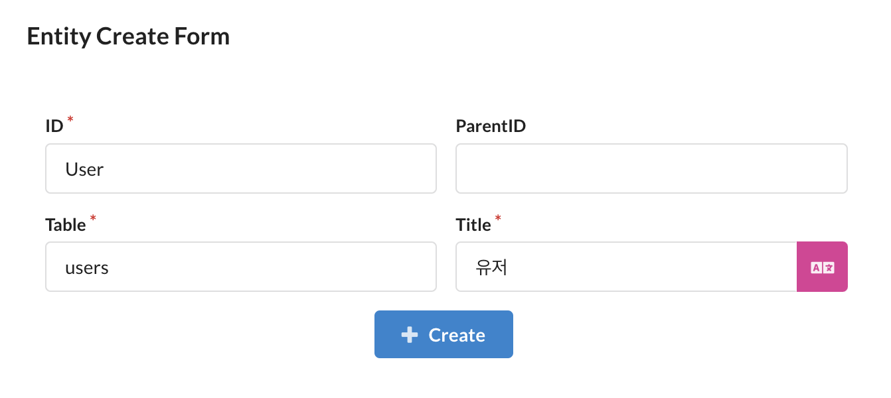
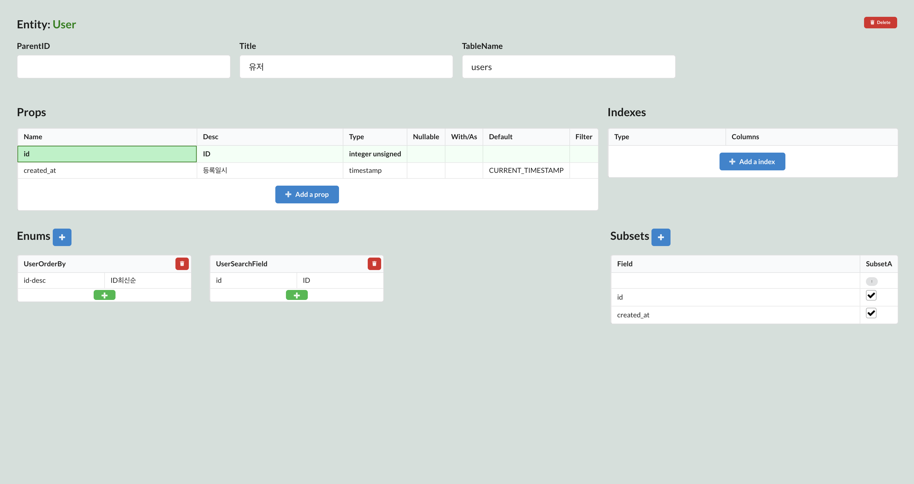
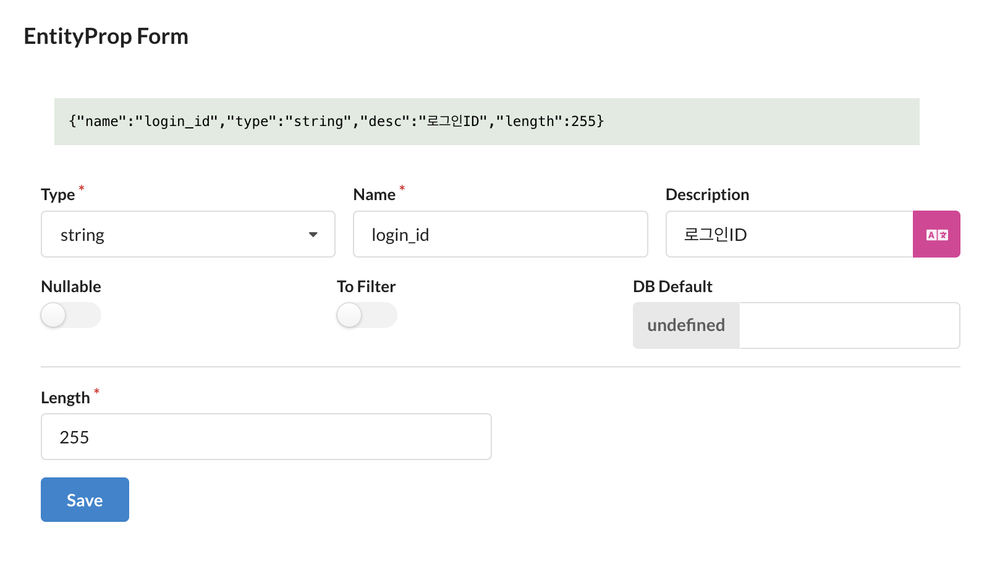
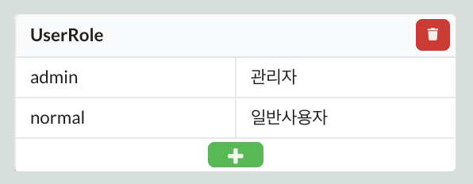
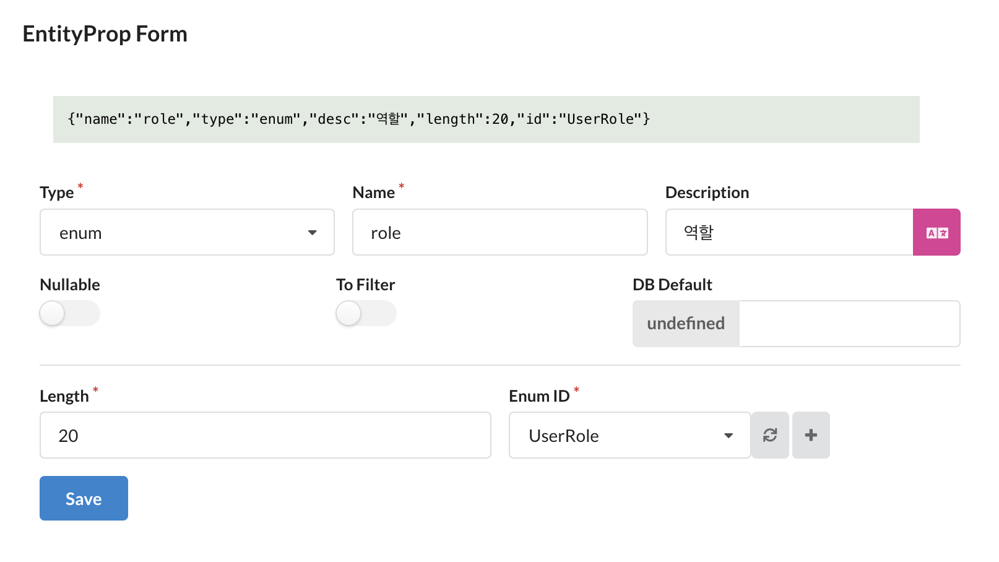
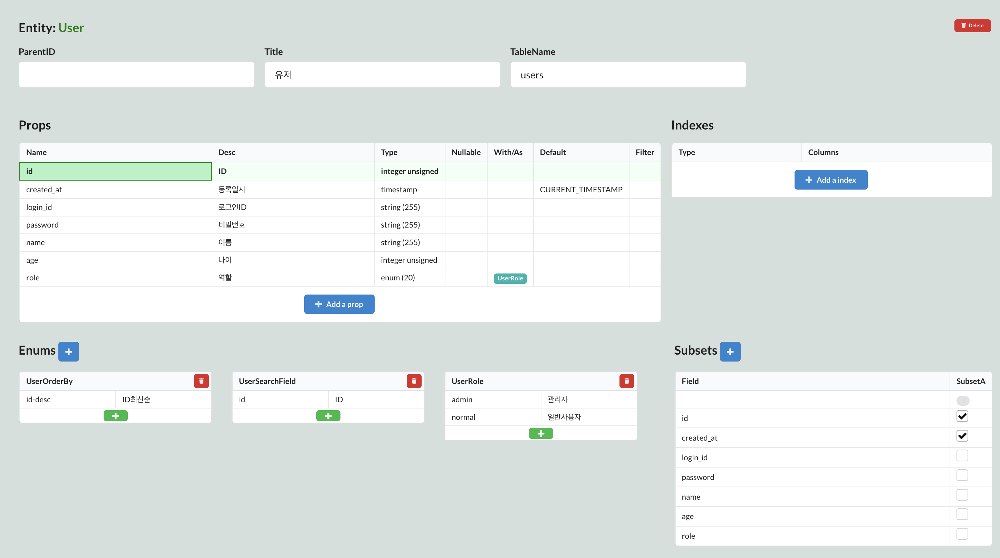
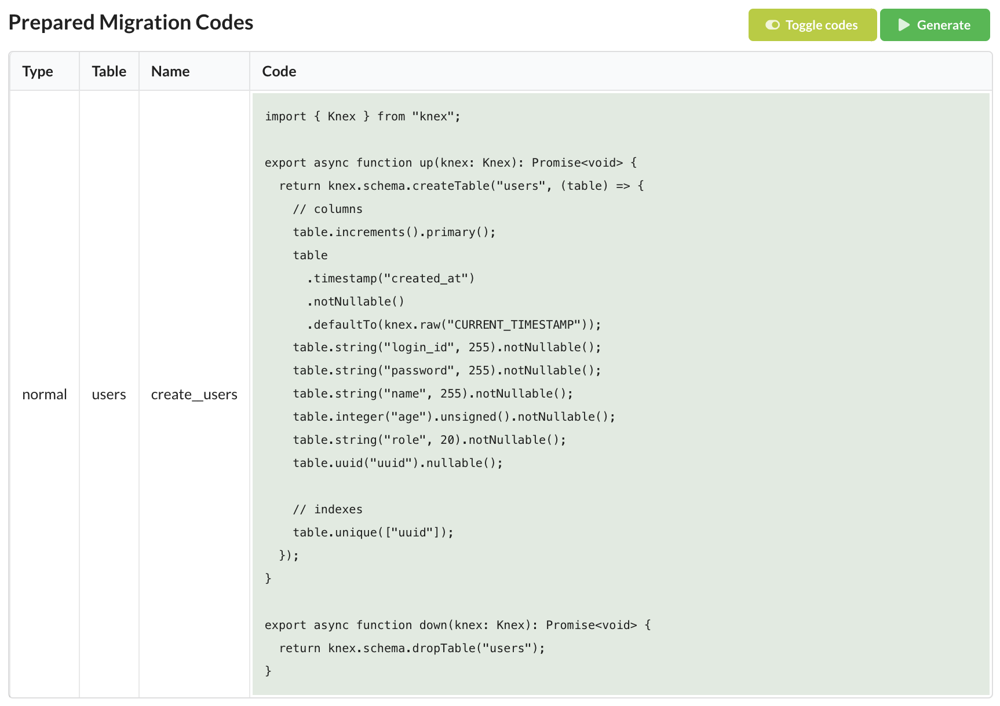
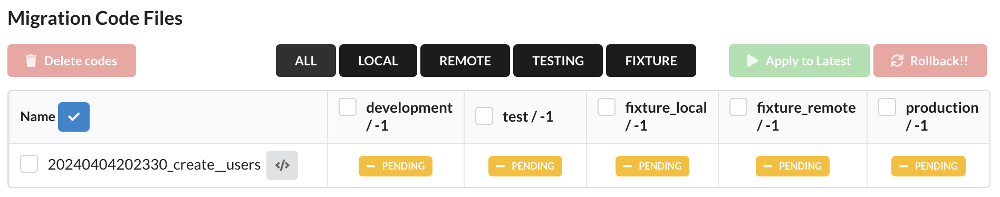
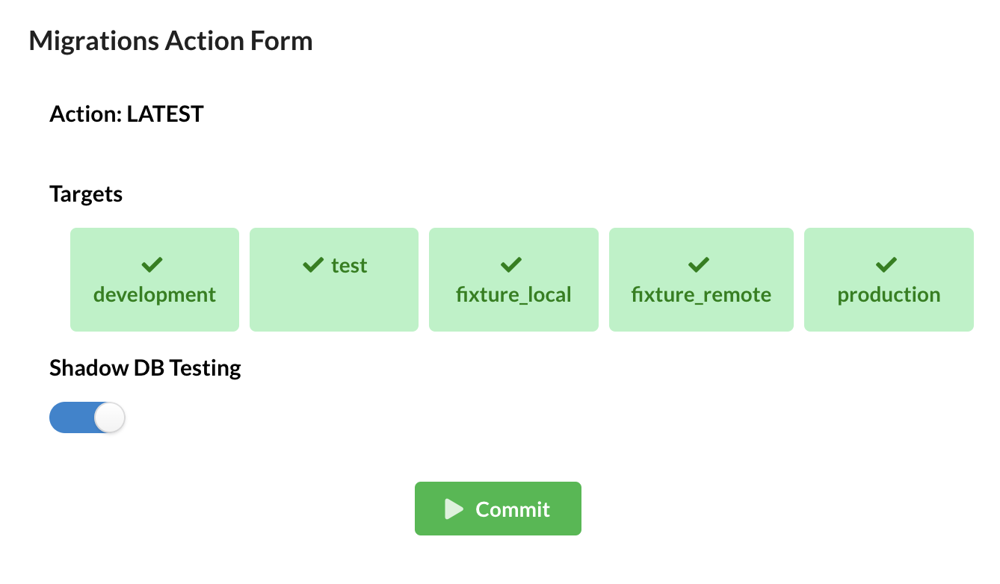
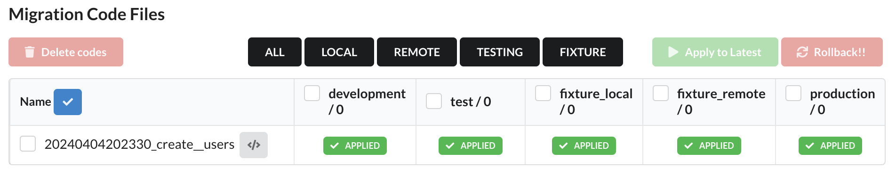

해당 튜토리얼은 Sonamu를 이용하여 유저, 게시글 엔티티를 생성하고 간단한 CRUD API를 만들어보는 과정을 안내합니다.

Sonamu UI를 이용하면 엔티티를 생성하여 서버에서 사용할 테이블 정의를 관리할 수 있고, 마이그레이션 파일을 생성하여 데이터베이스 스키마를 관리할 수 있습니다. 아래 명령어를 통해 Sonamu UI를 실행하세요.

```shell
yarn sonamu ui
```

## Entities

### 엔티티 생성

먼저, 유저 엔티티를 생성해보겠습니다. `Entities` 탭으로 진입하여 엔티티 추가 버튼을 클릭합니다.



- `ID`: 소나무 내부적으로 사용하는 엔티티 아이디
  - CamelCase로 작성하며, 공백이나 특수문자를 포함할 수 없습니다.
- `Table`: 데이터베이스 테이블 이름
  - `ID` 필드 입력 후 해당 필드를 포커스하면 자동완성 기능이 동작합니다.
- `Title`: 엔티티 설명
  - `ID` 필드 입력 후 해당 필드를 포커스하면 자동완성 기능이 동작합니다.

정보를 모두 기입하고 생성 버튼을 클릭하면 Sonamu UI 터미널에서 다음과 같은 로그를 확인할 수 있습니다.

```shell
GENERATED  api/src/application/user/user.entity.json
reload
autoload /.../api/src/application/**/*.entity.json
GENERATED  api/src/application/sonamu.generated.sso.ts
GENERATED  api/src/application/sonamu.generated.ts
GENERATED  api/src/application/user/user.types.ts
```

유저 엔티티 정의 파일(`user.entity.json`)이 생성되고, 서버가 재시작하면서 모든 엔티티 정의를 확인하여 Sonamu 생성 파일과 타입 파일을 생성합니다.

그리고 파일 변경에 의해 백엔드 서버가 재시작되면서, 아래와 같은 로그를 확인할 수 있습니다.

```shell
autoload /sonamu-tutorial/api/src/application/**/*.entity.json
Changed Files:  [
  '/src/application/sonamu.generated.ts',
  '/src/application/user/user.entity.json',
  '/src/application/user/user.types.ts'
]
// 액션: 스키마 생성
GENERATED  api/src/application/sonamu.generated.sso.ts
GENERATED  api/src/application/sonamu.generated.ts
// 액션: 파일 싱크 types / functions / generated
COPIED  web/src/services/user/user.types.ts
COPIED  web/src/services/sonamu.generated.ts
checksum saved /sonamu-tutorial/api/.so-checksum
```

변경된 파일을 확인하고, 파일 종류에 따라 정해진 액션을 수행합니다. 액션이 종료되면, 각 파일의 해시값을 `.so-checksum` 파일에 저장합니다. 이를 통해 파일 변경 여부를 식별하고, 변경된 파일만 처리할 수 있습니다.

```json
// .so-checksum
[
  {
    "path": "/src/application/sonamu.generated.ts",
    "checksum": "f612e4ec83b27f7376287a93002ef644b1c2ef28"
  },
  {
    "path": "/src/application/user/user.entity.json",
    "checksum": "aab2fa95e21bb0d4ab70cb26b323e7800f0a7890"
  },
  {
    "path": "/src/application/user/user.types.ts",
    "checksum": "d860467474bdf8caf557039ecf835831a8ed73bb"
  }
]
```

### 필드 추가

계속해서 유저 엔티티에 필드를 추가해봅시다. `Entities` 탭에서 유저 엔티티를 클릭하면 엔티티 상세 페이지로 이동합니다.

`Add a prop` 버튼을 클릭하여 필드를 추가합니다.

로그인에 사용할 아이디 필드를 추가해봅시다. `Type`은 `string`으로 정의하고, `Name`은 `login_id`로 지정합니다. `Name`을 지정한 뒤 `Description` 필드를 포커스하면 내용이 자동완성됩니다. 수정이 필요한 경우에는 직접 입력할 수 있습니다. 입력된 내용은 Sonamu의 자동완성 기능에 반영됩니다.



- `Type`: 필드 타입
- `Name`: 필드 이름(컬럼명)
- `Description`: 필드 설명
  - `Name` 필드 입력 후 해당 필드를 포커스하면 자동완성됩니다.

:::note
`virtual` 필드와 `relation` 필드(`HasMany`, `ManyToMany`)를 제외한 모든 필드는 데이터베이스 테이블에 컬럼으로 추가됩니다.
:::

<br/>

이번에는 `role` 필드를 추가해봅시다. `role` 필드는 `enum` 타입으로 정의하고, `normal`와 `admin` 두 가지 값을 가질 수 있습니다.

먼저, `Enums` 옆의 `+` 버튼을 클릭하여 `UserRole`을 생성하고, `normal`과 `admin` 두 가지 값을 추가합니다.



그리고 `role` 필드를 추가합니다.



`Type`은 `enum`을 선택하고, `Enum ID`는 위에서 생성한 `UserRole`로 지정합니다.

그 외에 비밀번호, 이름, 나이 필드를 추가하여 아래와 같이 유저 엔티티를 정의합니다.



## DB Migration

### 마이그레이션 파일 생성

위에서 정의한 유저 엔티티를 데이터베이스에 반영하기 위해 마이그레이션 파일을 생성해봅시다. `DB Migration` 탭으로 이동하여 `Prepared Migration Codes` 테이블을 확인합니다. 해당 테이블은 실제 데이터베이스의 스키마와 비교하여 생성 가능한 마이그레이션 파일을 보여줍니다.



`Generate`를 클릭하여 마이그레이션 파일을 생성합니다. Sonamu UI 터미널에서 다음과 같은 로그를 확인할 수 있습니다.

```shell
MIGRTAION CREATED /.../api/src/migrations/20240404202330_create__users.ts
```

### 마이그레이션 파일 적용

`DB Migration` 탭의 `Migration Code Files` 테이블에서 생성된 마이그레이션 파일과 각 데이터베이스의 적용 여부를 확인할 수 있습니다.



검정색 버튼을 이용하여 적용할 데이터베이스를 쉽게 선택할 수 있습니다. `Apply to Latest` 버튼을 클릭하면 마이그레이션 실행 모달이 나타납니다.



위의 모달에서 쉐도우 DB 테스트 실행 여부를 선택할 수 있습니다. `Commit` 버튼을 클릭하면 마이그레이션이 실행됩니다. 생성된 모든 파일이 트랜잭션 단위로 적용됩니다.

쉐도우 DB 테스트를 실행하면 Sonamu UI 터미널에서 다음과 같은 로그를 확인할 수 있습니다. 쉐도우 DB 테스트를 실행하지 않을 경우 아무 로그도 나타나지 않습니다.

```shell
sonamu-tutorial_test의 데이터 /tmp/sonamu-tutorial_test__migration_shadow.sql로 덤프
sonamu-tutorial_test__migration_shadow 리셋
sonamu-tutorial_test__migration_shadow 데이터베이스 생성
Shadow DB 테스트에 성공했습니다! { batchNo: 1, applied: [ '20240404202330_create__users.js' ] }
sonamu-tutorial_test__migration_shadow 삭제
```

마이그레이션이 성공적으로 적용되면 `Migration Code Files` 테이블에서 적용된 마이그레이션 파일 및 데이터베이스 상태가 최신(`0`)으로 설정되어 있는 것을 확인할 수 있습니다.



### 마이그레이션 롤백

마이그레이션을 롤백하려면 `Migration Code Files` 테이블에서 적용할 데이터베이스를 선택하고 `Rollback` 버튼을 클릭합니다. 롤백은 트랜잭션 단위로 실행되기 때문에, 한 번에 여러 파일을 적용한 경우에는 롤백도 한 번에 실행됩니다.

이 외에 마이그레이션에 대한 자세한 내용은 [마이그레이션](/reference/migration) 문서를 참고하세요.
