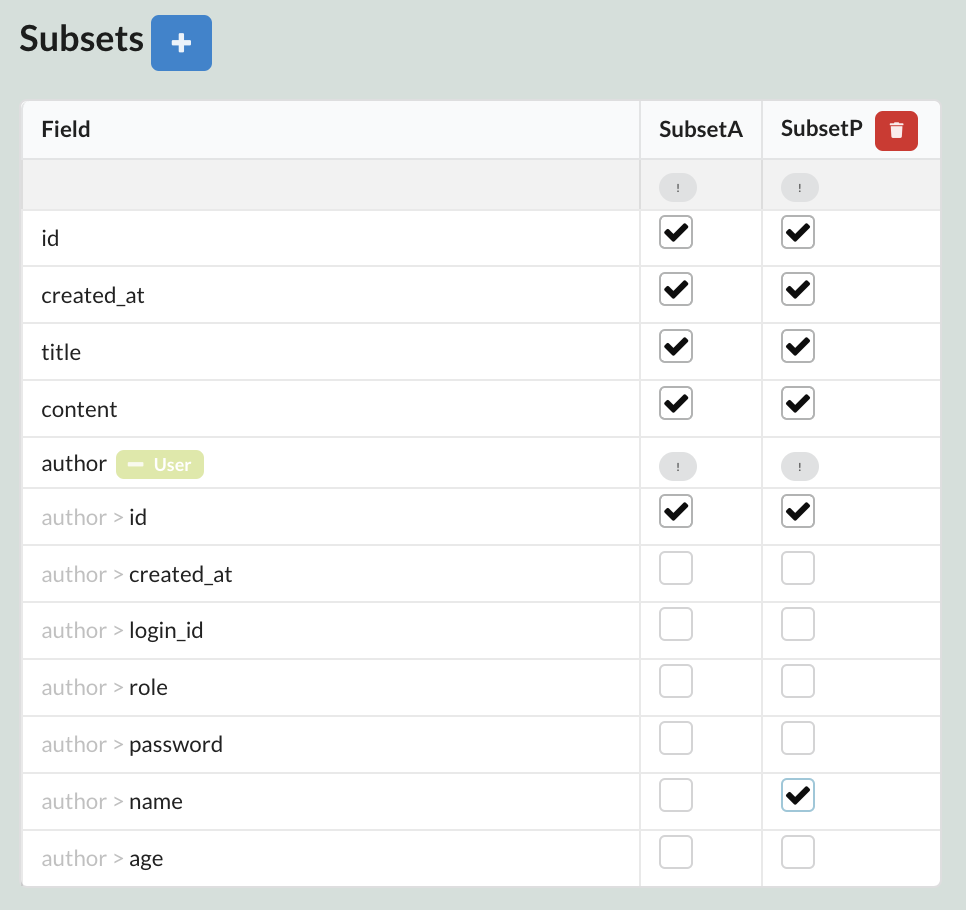

Sonamu가 자동으로 생성한 프론트엔드 서비스 코드를 이용하여 프론트엔드를 구현하는 방법을 설명합니다.

코드를 작성하기 전에, 먼저 `@sonamu-kit/react-sui` 패키지가 설치되어 있는지 확인합니다. 해당 패키지는 Sonamu 프로젝트에서 사용하는 UI 라이브러리입니다. `@sonamu-kit/react-sui` 패키지는 `semantic-ui-react` 패키지를 기반으로 하며, Sonamu 프로젝트에서 사용하기 위한 컴포넌트 및 훅을 제공합니다.

```shell
yarn add @sonamu-kit/react-sui
```

## 동기화된 파일

Sonamu는 백엔드 작업 시 작업의 종류에 따라 프론트엔드 디렉터리에 파일을 동기화(복사)합니다. 동기화되는 파일은 다음과 같습니다.

- 타입 파일(`.types.ts`)
- 서비스 파일(`.service.ts`)
- Sonamu 생성 파일(`sonamu.generated.ts`)

## 서비스 코드

Sonamu는 `@api` 데코레이터로 등록된 API를 기반으로 프론트엔드 서비스 코드를 자동으로 생성합니다. 프론트엔드 서비스 코드는 `web/src/services` 디렉터리에 위치합니다.

### 게시글 목록

먼저, 게시글의 어떤 필드를 조회할지 설정해야 합니다. Sonamu UI에 접속하여 게시글 엔티티 페이지로 이동한 후, `Subsets` 테이블에서 아래와 같이 `P` 서브셋을 생성합니다. `P`는 `Public`의 약자로, 프론트엔드에서 게시글을 조회할 때 사용할 서브셋입니다.



<br/>

다음으로, 게시글 목록을 보여주는 페이지를 구현해보겠습니다. `web/src/pages` 디렉터리에 `post` 디렉터리를 생성하고, 아래와 같이 `index.tsx` 파일을 작성합니다.

```tsx
// pages/post/index.tsx
import { useListParams } from "@sonamu-kit/react-sui";
import {
  List,
  ListContent,
  ListHeader,
  ListItem,
  Pagination,
} from "semantic-ui-react";
import { PostListParams } from "../../services/post/post.types";
import { PostService } from "../../services/post/post.service";

export default function PostList() {
  const { listParams, setListParams, register } = useListParams(
    PostListParams,
    { num: 10, page: 1, orderBy: "id-desc" }
  );

  const { data, isLoading, error, mutate } = PostService.usePosts(
    "P",
    listParams
  );

  return (
    <div>
      <h1>Sonamu</h1>

      <List divided>
        {data?.rows.map((e) => (
          <ListItem key={e.id}>
            <ListContent as="a" href={`/post/${e.id}`}>
              <ListHeader>{e.title}</ListHeader>
              {e.author.name} | {e.created_at}
            </ListContent>
          </ListItem>
        ))}
      </List>
      {data && data.total && listParams.num && (
        <Pagination
          totalPages={Math.ceil(data.total / listParams.num)}
          {...register("page")}
        />
      )}
    </div>
  );
}
```

위 코드는 게시글 목록을 보여주는 페이지를 구현한 것입니다. `useListParams` 훅을 이용하여 게시글 목록을 조회하기 위한 파라미터를 설정하고, `PostService.usePosts`를 이용하여 게시글 목록을 조회합니다. 이제 `localhost:16001/post`로 접속하여 게시글 목록을 확인할 수 있습니다.

### 게시글 작성

다음으로, 게시글을 작성하는 페이지를 구현해보겠습니다. `web/src/pages/post/write` 디렉터리에 `index.tsx` 파일을 생성하고, 아래와 같이 코드를 작성합니다.

```tsx
// pages/post/write/index.tsx
import { useTypeForm } from "@sonamu-kit/react-sui";
import { useState } from "react";
import { useNavigate } from "react-router-dom";
import { Button, Form, Input, Label, TextArea } from "semantic-ui-react";
import { PostService } from "src/services/post/post.service";
import { PostSaveMineParams } from "src/services/post/post.types";
import { defaultCatch } from "src/services/sonamu.shared";

export default function PostWrite() {
  const navigate = useNavigate();

  const [loading, setLoading] = useState(false);
  const { form, register } = useTypeForm(PostSaveMineParams, {
    title: "",
    content: "",
    author_id: 1,
  });

  const submit = () => {
    setLoading(true);
    PostService.saveMine(form)
      .then(() => navigate("/post"))
      .catch(defaultCatch)
      .finally(() => setLoading(false));
  };

  return (
    <div>
      <Form>
        <Input placeholder="제목" {...register("title")} />
        <TextArea placeholder="내용" {...register("content")} />
        <Button onClick={submit} disabled={loading}>
          저장
        </Button>
      </Form>
    </div>
  );
}
```

위 코드는 게시글을 작성하는 페이지를 구현한 것입니다. `useTypeForm` 훅을 이용하여 게시글 작성을 위한 폼을 설정하고, `PostService.saveMine`을 이용하여 게시글을 저장합니다. 이제 `localhost:16001/post/write`로 접속하여 게시글을 작성할 수 있습니다.

## 마치며

Sonamu가 생성한 프론트엔드 서비스 코드와 `@sonamu-kit`을 이용하여 아주 간단한 프론트엔드를 구현해보았습니다. 더 자세한 내용은 [@sonamu-kit 문서](/reference/sonamu-kit)를 참고하세요.
