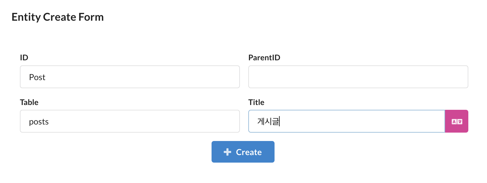

이번에는 게시글 엔티티를 생성하고, 유저 엔티티와의 관계를 설정해보겠습니다.

## 게시글 엔티티

유저 엔티티와 마찬가지로, `Entities` 탭에서 엔티티 추가를 클릭하고, `Post`라는 이름으로 엔티티를 생성합니다.



`Post` 엔티티에는 아래와 같은 필드를 추가합니다.

- `title`: 게시글 제목
  - 타입: `string`
- `content`: 게시글 내용
  - 타입: `text`
- `author`: 게시글 작성자
  - 타입: `relation`

`author` 필드는 `User` 엔티티와의 관계를 설정합니다. `Type`을 `relation`으로 설정하면, 아래에 `Relation Type`, `With` 등 조인 관련 설정이 나타납니다. `Relation Type`을 `BelongsToOne`으로 설정하고, `With`를 `User`로 설정합니다.


필드를 모두 추가했으면, `DB Migration` 탭에서 마이그레이션 파일을 생성합니다. 게시글 테이블을 생성하는 마이그레이션 파일과 유저 테이블과의 관계를 설정하는 마이그레이션 파일이 생성됩니다.

```typescript
// create__posts
export async function up(knex: Knex): Promise<void> {
  return knex.schema.createTable("posts", (table) => {
    // columns
    table.increments().primary();
    table
      .timestamp("created_at")
      .notNullable()
      .defaultTo(knex.raw("CURRENT_TIMESTAMP"));
    table.string("title", 100).notNullable();
    table.text("content").notNullable();
    table.integer("author_id").unsigned().notNullable();
    table.uuid("uuid").nullable();

    // indexes
    table.unique(["uuid"]);
  });
}

export async function down(knex: Knex): Promise<void> {
  return knex.schema.dropTable("posts");
}

// foreign__posts__author_id
export async function up(knex: Knex): Promise<void> {
  return knex.schema.alterTable("posts", (table) => {
    // create fk
    table
      .foreign("author_id")
      .references("users.id")
      .onUpdate("CASCADE")
      .onDelete("CASCADE");
  });
}

export async function down(knex: Knex): Promise<void> {
  return knex.schema.alterTable("posts", (table) => {
    // drop fk
    table.dropForeign(["author_id"]);
  });
}
```

마이그레이션을 모두 실행하면, 게시글 테이블이 생성되고, 유저 테이블과의 관계가 설정됩니다.

<br/>

---

## 게시글 모델

위에서 생성한 게시글 엔티티를 이용하여 게시글 작성, 조회, 수정, 삭제 API를 작성해보겠습니다. 우선 `Scaffolding` 탭으로 이동하여 게시글 엔티티에 대한 모델 코드를 생성합니다.

### 게시글 작성 API

먼저, 게시글 작성 API를 작성해보겠습니다. 게시글 작성 API는 게시글 제목, 내용, 작성자 아이디를 입력받아 게시글을 생성하는 API입니다.

게시글 작성 API의 파라미터는 스캐폴딩 과정에서 생성된 `PostSaveParams`를 사용하여 작성합니다.

```typescript
// post.types.ts
// Post - SaveMineParams
export const PostSaveMineParams = PostSaveParams.pick({
  title: true,
  content: true,
  author_id: true,
});
export type PostSaveMineParams = z.infer<typeof PostSaveMineParams>;
```

다음으로, 게시글 작성 API를 작성합니다. `post.model.ts` 파일을 열고, 아래와 같이 메서드를 작성하고, `@api` 데코레이터를 추가합니다.

```typescript
// post.model.ts
import { NotFoundException, api, UnauthorizedException } from "sonamu";
import { PostSubsetKey, PostSubsetMapping } from "../sonamu.generated";
import { postSubsetQueries } from "../sonamu.generated.sso";
import { PostSaveMineParams, PostSaveParams } from "./post.types";

@api({ httpMethod: "POST" })
async saveMine(smp: PostSaveMineParams): Promise<number> {
  const sp: PostSaveParams = {
    ...smp,
  };

  const [id] = await this.save([sp]);

  return id;
}
```

이제 `sonamu.generated.http` 파일을 이용하여 해당 API를 호출해보겠습니다. `author_id`는 이전에 생성한 유저의 `id`를 사용합니다.

```http
// sonamu.generated.http

POST {{baseUrl}}/api/post/saveMine
Content-Type: application/json

{ "smp": {  "title": "TITLE", "content": "CONTENT", "author_id": 1 } }
```

위와 같이 요청을 보내면, 게시글이 생성되고, 생성된 게시글의 `id`가 반환됩니다.

### 게시글 조회 API

다음으로, 게시글 조회 API를 작성해보겠습니다. `id`를 이용한 게시글 조회 API는 모델 스캐폴딩에서 `findById` 메서드로 생성되어 있습니다. 따라서, `id`가 아니라 제목을 이용한 게시글 검색 API를 작성해보겠습니다.

게시글 검색 API의 파라미터는 스캐폴딩 과정에서 생성된 `PostListParams`의 `search` 필드와 `keyword`를 사용하여 작성합니다. Sonamu UI의 `Entities` 탭에서 `Post` 엔티티를 클릭하면, `Enums` 탭에서 `PostSearchField`를 확인할 수 있습니다. `PostListParams`의 `search` 필드는 해당 열거형을 사용하기 때문에, 제목으로 게시글을 검색할 수 있도록 `PostSearchField`에 `title`을 추가합니다.


그런 다음 게시글 엔티티 파일을 보면, `PostSearchField` 열거형에 `title`이 추가된 것을 확인할 수 있습니다.

```json
// post.entity.json

{
  ...

  "enums": {
    "PostSearchField": { "id": "ID", "title": "제목" }
  }
}
```

`search` 필드는 `PostBaseListParams`에 추가되어 있으므로, 타입을 변경하는 작업은 필요하지 않습니다. 이제 `findMany` 메서드에서 `search` 필드를 이용하여 게시글을 검색할 수 있도록 수정합니다.

```typescript
// post.model.ts
@api({ httpMethod: "GET", clients: ["axios", "swr"], resourceName: "Posts" })
async findMany<T extends PostSubsetKey>(
  subset: T,
  params: PostListParams = {}
): Promise<ListResult<PostSubsetMapping[T]>> {
  ...

      // search-keyword
      if (params.search && params.keyword && params.keyword.length > 0) {
        if (params.search === "id") {
          qb.where("posts.id", params.keyword);
        } else if (params.search === "title") {
          qb.where("posts.title", "like", `%${params.keyword}%`);
        } else {
          throw new BadRequestException(
            `구현되지 않은 검색 필드 ${params.search}`
          );
        }
      }

  ...
}
```

`findMany` 수정이 끝났으면 조회 결과로 확인하고 싶은 필드를 추가해봅시다. Sonamu UI의 `Entities`탭으로 이동한 다음, 게시글 엔티티를 선택하고, 우측 하단에 보이는 `Subsets` 테이블에서 조회 결과로 확인하고 싶은 필드를 추가합니다.


이제 `sonamu.generated.http` 파일을 이용하여 해당 API를 호출해보겠습니다. `search`와 `keyword` 필드를 이용하여 게시글을 검색할 수 있습니다.

```http
// sonamu.generated.http

GET {{baseUrl}}/api/post/findMany
	?subset=A
	&params[search]=title
	&params[keyword]=TEST
Content-Type: application/json
```

위와 같이 요청을 보내면, 제목에 `TEST`가 포함된 게시글이 반환됩니다.

```
{
  "rows": [
    {
      "id": 1,
      "created_at": "2024-04-23 18:03:43",
      "title": "TITLE",
      "content": "CONTENT",
      "author_id": 1
    }
  ],
  "total": 1
}
```

:::note
서브셋에서 하위 객체의 필드를 추가할 때, `id`만 선택한 경우 `${entityId}_id`로 확인할 수 있습니다. `id` 외의 필드를 선택하거나 여러 필드를 선택하는 경우 `${entityId}.id`로 확인할 수 있습니다.
:::

### 게시글 수정 API

게시글 수정 API는 게시글 작성 API를 이용하여 작성하겠습니다. 게시글의 id가 주어지면, 해당 게시글을 조회하고, 작성자와 현재 유저가 일치하는지 확인한 후, 게시글을 수정합니다.

```typescript
// post.types.ts

// Post - SaveMineParams
export const PostSaveMineParams = PostSaveParams.pick({
  id: true,
  title: true,
  content: true,
  author_id: true,
});
export type PostSaveMineParams = z.infer<typeof PostSaveMineParams>;
```

```typescript
// post.model.ts

@api({ httpMethod: "POST" })
async saveMine(smp: PostSaveMineParams): Promise<number> {
  if (smp.id) {
    const post = await this.findById("A", smp.id);
    if (post.author_id !== smp.author_id) {
      throw new UnauthorizedException("본인의 글만 수정할 수 있습니다.");
    }
  }

  const sp: PostSaveParams = {
    ...smp,
  };

  const [id] = await this.save([sp]);

  return id;
}
```

이제 `sonamu.generated.http` 파일을 이용하여 해당 API를 호출해보겠습니다. `id`를 이용하여 게시글을 수정할 수 있습니다.

```http
// sonamu.generated.http

POST {{baseUrl}}/api/post/saveMine

{ "smp": { "id": 1, "title": "제목 수정", "content": "CONTENT", "author_id": 1 } }
Content-Type: application/json
```

### 게시글 삭제 API

게시글 삭제 API는 게시글 `id`를 이용하여 게시글을 삭제하는 API입니다. `id`를 이용하여 게시글을 조회하고, 해당 게시글의 작성자와 현재 유저가 일치하는지 확인합니다.

```typescript
// post.model.ts
@api({ httpMethod: "POST" })
async delMine(id: number, author_id: number): Promise<number> {
  const post = await this.findById("A", id);
  if (post.author_id !== author_id) {
    throw new UnauthorizedException("본인의 글만 삭제할 수 있습니다.");
  }

  return this.del([id]);
}
```

이제 `sonamu.generated.http` 파일을 이용하여 해당 API를 호출해보겠습니다. `id`를 이용하여 게시글을 삭제할 수 있습니다.

```http
// sonamu.generated.http

POST {{baseUrl}}/api/post/delMine

{ "id": 1, "author_id": 1 }
Content-Type: application/json
```
