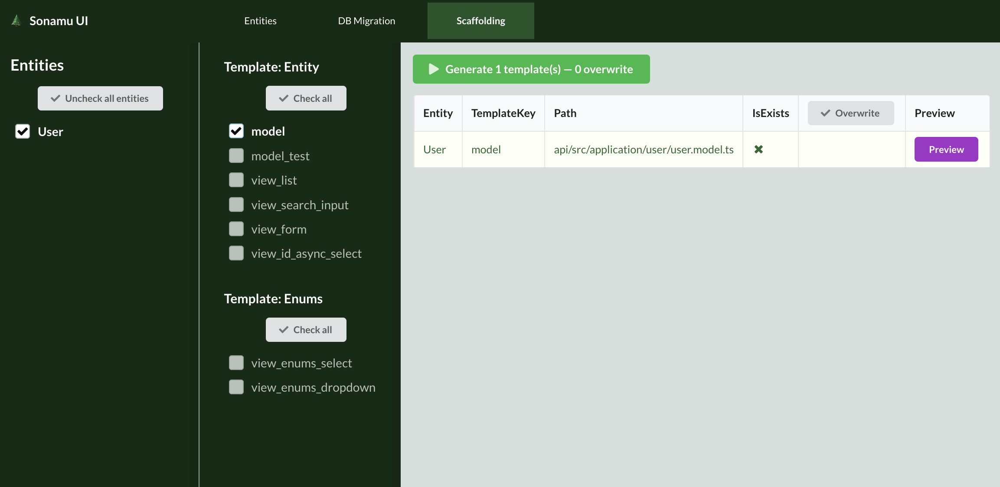

작성한 유저 엔티티를 기반으로 모델 코드를 스캐폴딩하는 방법을 설명합니다. Sonamu에서 모델이란, 엔티티 정의를 기반으로 CRUD 로직과 비즈니스 로직을 포함하는 클래스를 말합니다.

Sonamu UI의 `Scaffolding` 탭으로 이동하여 `Entities`는 `User`를 선택하고, `Template`은 `model`을 선택합니다.



보라색 `Preview` 버튼을 클릭하면 생성할 코드를 확인할 수 있습니다.

`Generate` 버튼을 클릭하면 테이블에 표시되는 모든 파일이 생성됩니다. Sonamu UI 터미널에서 다음과 같은 로그를 확인할 수 있습니다.

```shell
GENERATED  api/src/application/user/user.model.ts
[
  [
    [
      '/sonamu-tutorial/api/src/application/user/user.model.ts'
    ]
  ]
]
```

생성된 파일들은 Sonamu UI의 파일 목록의 `IsExists` 컬럼에 `</>` 버튼을 클릭하여 VSCode에서 바로 열어볼 수 있습니다.

:::tip
`</>` 버튼을 이용하여 VSCode에서 파일을 열기 위해서는 `code` 커맨드가 설정되어 있어야 합니다. [VSCode - Launching from the command line](https://code.visualstudio.com/docs/setup/mac#_launching-from-the-command-line) 페이지를 참고하세요.
:::

생성된 모델 파일은

- 기본 CRUD 작업을 위한 메서드
- API 데코레이터를 이용하여 HTTP 엔드포인트 정의 및 권한 가드 설정

을 포함하고 있습니다. 필요에 따라 로직을 추가하거나 수정할 수 있습니다.

```typescript
// user.model.ts
class UserModelClass extends BaseModelClass {
  modelName = "User";

  @api({ httpMethod: "GET", clients: ["axios", "swr"], resourceName: "User" })
  async findById<T extends UserSubsetKey>(
    subset: T,
    id: number
  ): Promise<UserSubsetMapping[T]> {
    // ...
  }

  async findOne<T extends UserSubsetKey>(
    subset: T,
    listParams: UserListParams
  ): Promise<UserSubsetMapping[T] | null> {
    // ...
  }

  @api({ httpMethod: "GET", clients: ["axios", "swr"], resourceName: "Users" })
  async findMany<T extends UserSubsetKey>(
    subset: T,
    params: UserListParams = {}
  ): Promise<ListResult<UserSubsetMapping[T]>> {
    // ...
  }

  @api({ httpMethod: "POST" })
  async save(spa: UserSaveParams[]): Promise<number[]> {
    // ...
  }

  @api({ httpMethod: "POST", guards: ["admin"] })
  async del(ids: number[]): Promise<number> {
    // ...
  }
}

export const UserModel = new UserModelClass();
```

모델 파일을 생성하면 어플리케이션 서버 터미널에 아래와 같은 로그가 출력됩니다.

```shell
DB Config Loaded!
autoload /tutorial/api/src/application/**/*.entity.json
Changed Files:  [ '/dist/application/user/user.model.js' ]
// 액션: 서비스 생성
GENERATED  web/src/services/user/user.service.ts
// 액션: HTTP파일 생성
GENERATED  api/src/application/sonamu.generated.http
checksum saved /tutorial/api/.so-checksum
Sonamu.init: 136.793ms
```

모델 파일이 생성되면 해당 모델에 등록된 API를 호출하기 위한 service 파일과 HTTP 파일이 생성됩니다. HTTP 파일은 VSCode의 REST Client 확장을 사용하여 API를 쉽게 테스트할 수 있도록 템플릿을 제공합니다. service 파일은 API를 호출하는 로직을 포함하며, Axios, SWR 등 다양한 HTTP 클라이언트를 지원합니다.
